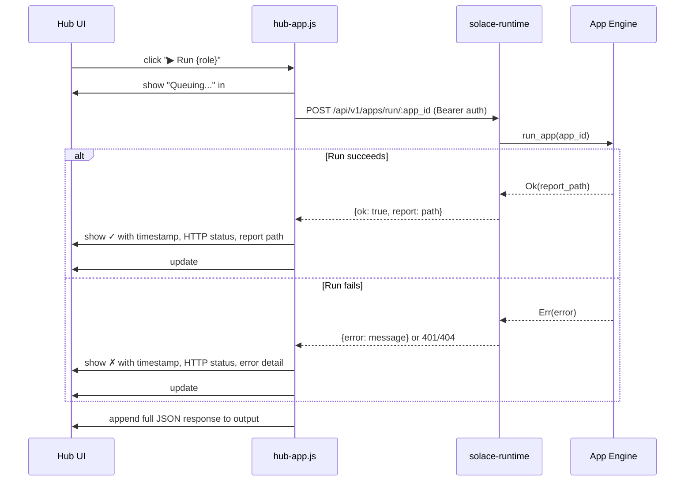

# Run Feedback Flow

Governs: how the worker control shows visible structured feedback after a run action.

```mermaid
sequenceDiagram
    participant U as Hub UI
    participant JS as hub-app.js
    participant RT as solace-runtime
    participant AE as App Engine

    U->>JS: click "▶ Run {role}"
    JS->>U: show "Queuing..." in #worker-control-output
    JS->>RT: POST /api/v1/apps/run/:app_id (Bearer auth)
    RT->>AE: run_app(app_id)

    alt Run succeeds
        AE-->>RT: Ok(report_path)
        RT-->>JS: {ok: true, report: path}
        JS->>U: show ✓ with timestamp, HTTP status, report path
        JS->>U: update #dev-last-run with green pill
    else Run fails
        AE-->>RT: Err(error)
        RT-->>JS: {error: message} or 401/404
        JS->>U: show ✗ with timestamp, HTTP status, error detail
        JS->>U: update #dev-last-run with red pill
    end

    JS->>U: append full JSON response to output
```
