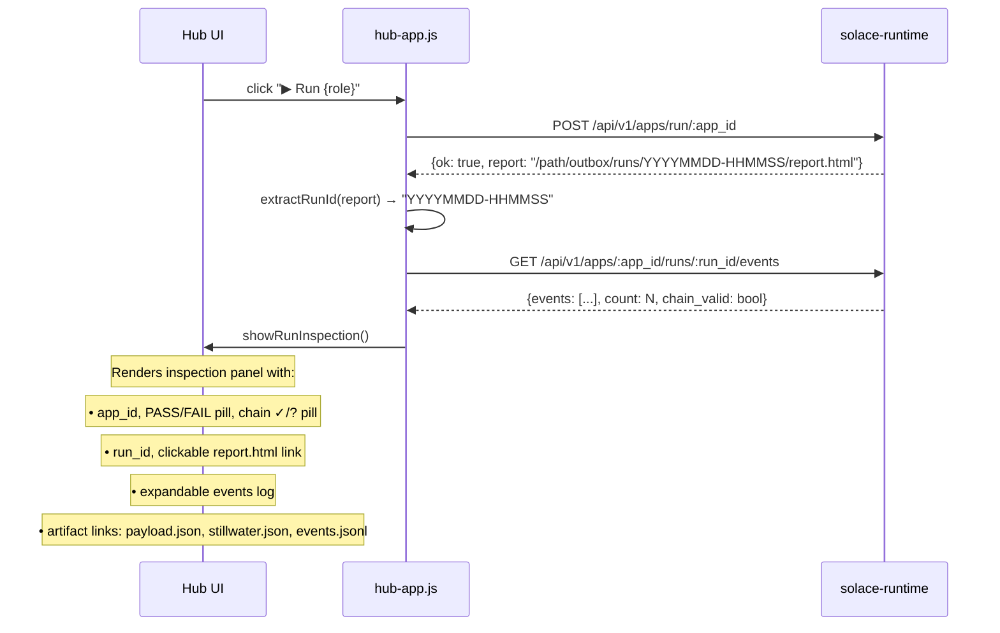

# Run Inspection Flow

Governs: how a worker run becomes fully inspectable in the Dev workspace.

```mermaid
sequenceDiagram
    participant U as Hub UI
    participant JS as hub-app.js
    participant RT as solace-runtime

    U->>JS: click "▶ Run {role}"
    JS->>RT: POST /api/v1/apps/run/:app_id
    RT-->>JS: {ok: true, report: "/path/outbox/runs/YYYYMMDD-HHMMSS/report.html"}

    JS->>JS: extractRunId(report) → "YYYYMMDD-HHMMSS"

    JS->>RT: GET /api/v1/apps/:app_id/runs/:run_id/events
    RT-->>JS: {events: [...], count: N, chain_valid: bool}

    JS->>U: showRunInspection()
    Note over U: Renders inspection panel with:
    Note over U: • app_id, PASS/FAIL pill, chain ✓/? pill
    Note over U: • run_id, clickable report.html link
    Note over U: • expandable events log
    Note over U: • artifact links: payload.json, stillwater.json, events.jsonl
```
