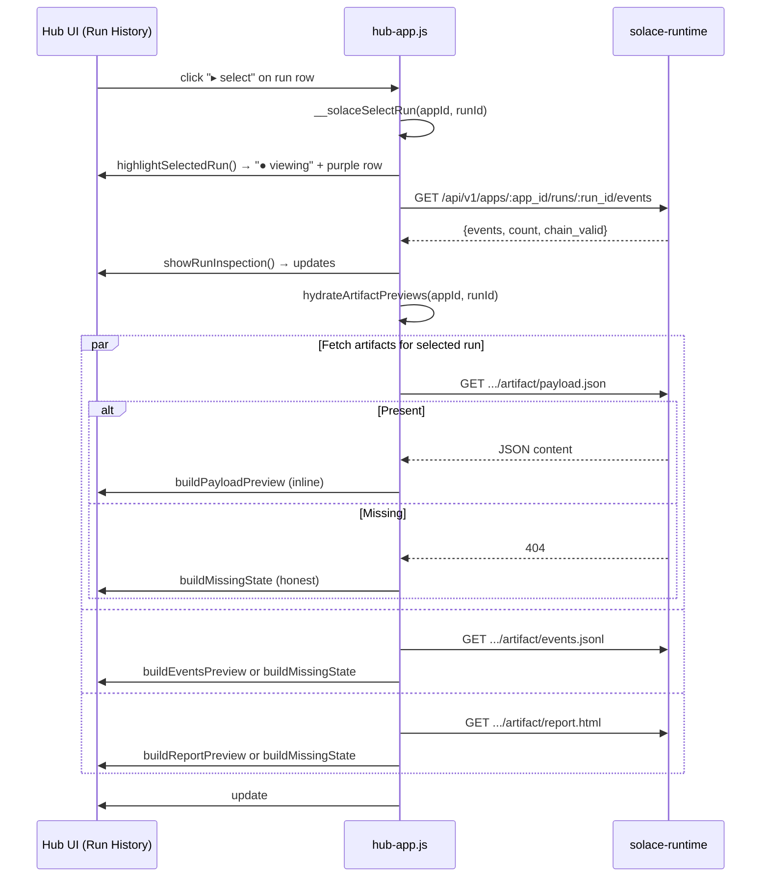

# Run Selection and Artifact Switching Flow

Governs: how selecting a historical run updates the workspace inspection and preview panels.

```mermaid
sequenceDiagram
    participant U as Hub UI (Run History)
    participant JS as hub-app.js
    participant RT as solace-runtime

    U->>JS: click "▸ select" on run row
    JS->>JS: __solaceSelectRun(appId, runId)
    JS->>U: highlightSelectedRun() → "● viewing" + purple row

    JS->>RT: GET /api/v1/apps/:app_id/runs/:run_id/events
    RT-->>JS: {events, count, chain_valid}
    JS->>U: showRunInspection() → updates #dev-run-inspection

    JS->>JS: hydrateArtifactPreviews(appId, runId)
    par Fetch artifacts for selected run
        JS->>RT: GET .../artifact/payload.json
        alt Present
            RT-->>JS: JSON content
            JS->>U: buildPayloadPreview (inline)
        else Missing
            RT-->>JS: 404
            JS->>U: buildMissingState (honest)
        end
    and
        JS->>RT: GET .../artifact/events.jsonl
        JS->>U: buildEventsPreview or buildMissingState
    and
        JS->>RT: GET .../artifact/report.html
        JS->>U: buildReportPreview or buildMissingState
    end

    JS->>U: update #dev-last-run badge → "selected: {app} @ {run_id}"
```
