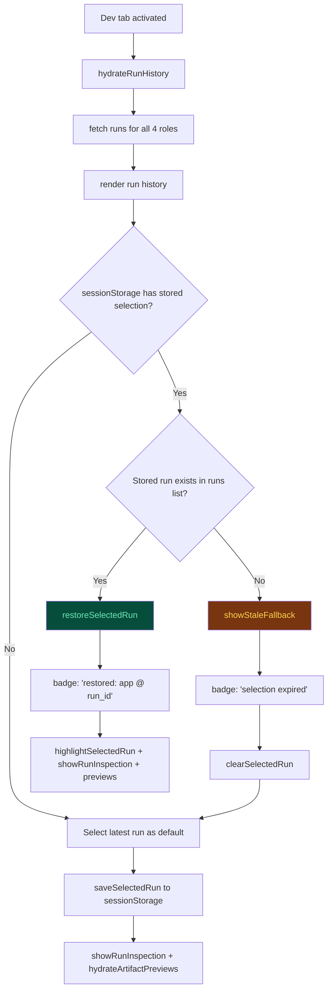
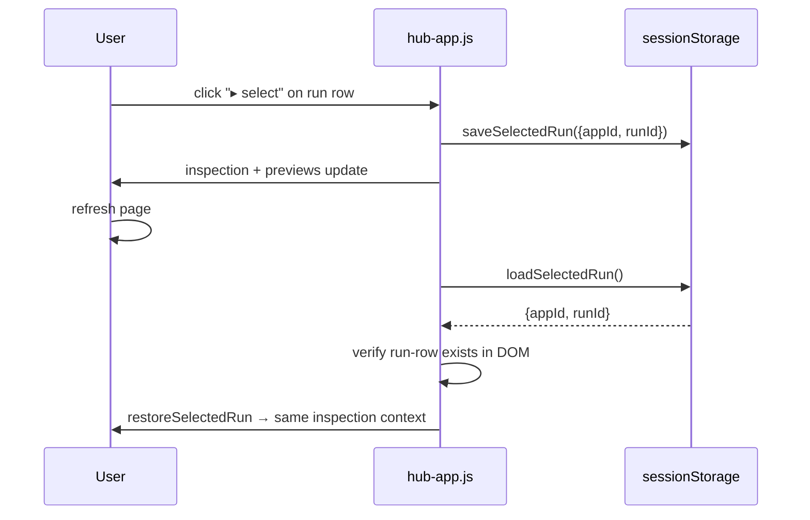

# Selected-Run Persistence Flow

Governs: how the Dev workspace persists and restores the user's run selection across refresh/activation.

```mermaid
flowchart TD
    A[Dev tab activated] --> B[hydrateRunHistory]
    B --> C[fetch runs for all 4 roles]
    C --> D[render run history]
    D --> E{sessionStorage has stored selection?}
    
    E -->|No| F[Select latest run as default]
    F --> G[saveSelectedRun to sessionStorage]
    G --> H[showRunInspection + hydrateArtifactPreviews]
    
    E -->|Yes| I{Stored run exists in runs list?}
    
    I -->|Yes| J[restoreSelectedRun]
    J --> K["badge: 'restored: app @ run_id'"]
    K --> L[highlightSelectedRun + showRunInspection + previews]
    
    I -->|No| M[showStaleFallback]
    M --> N["badge: 'selection expired'"]
    N --> O[clearSelectedRun]
    O --> F

    style M fill:#78350f,color:#fcd34d
    style J fill:#064e3b,color:#6ee7b7
```

## User Click Path

```mermaid
sequenceDiagram
    participant U as User
    participant JS as hub-app.js
    participant SS as sessionStorage

    U->>JS: click "▸ select" on run row
    JS->>SS: saveSelectedRun({appId, runId})
    JS->>U: inspection + previews update
    
    U->>U: refresh page
    
    JS->>SS: loadSelectedRun()
    SS-->>JS: {appId, runId}
    JS->>JS: verify run-row exists in DOM
    JS->>U: restoreSelectedRun → same inspection context
```
