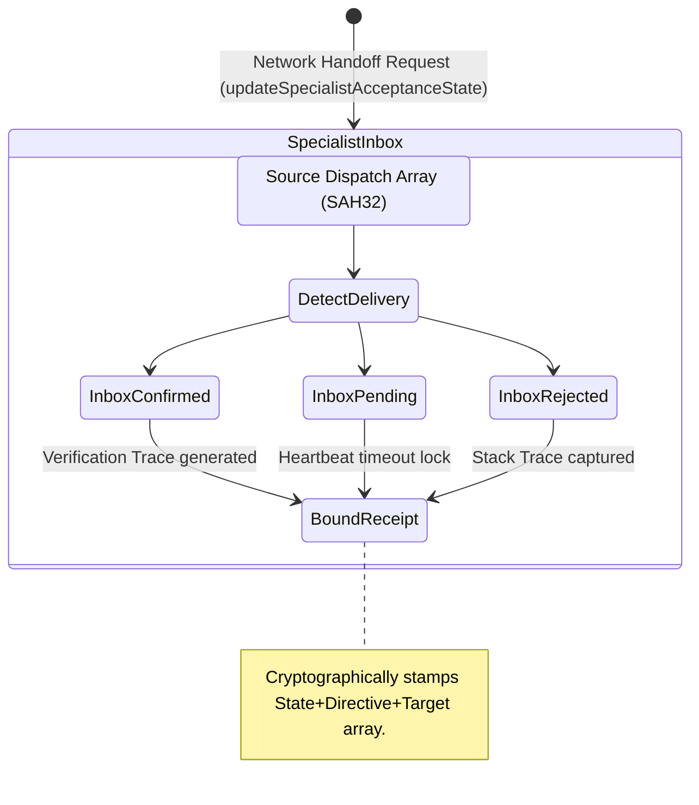

<!-- Diagram: 24-cpu-swarm-node-architecture -->
---
target_schema: prime-mermaid-v1
confidence: verification_gated
author: Grace Hopper (QA Diagrammer constraints)
description: Formal topology representing the final Inbox-Delivery verification boundary mapping SAH32 handoffs into strict ACK/NACK signatures from Specialist partitions.
context_paper: SI18 Transparency as Product Feature
---

# Structure: Specialist Acceptance State

Closing the Manager Oversight arc, this bounds the SI17 constraint determining whether a delegated assignment was genuinely consumed by the target Coder, QA, or Design node, isolating visibility from speculation.

## State Dictionary
- `SpecialistInbox`: The remote partition operating structurally distinct from the Hub.
- `DetectDelivery`: Measuring the native runtime delivery mechanism.
- `InboxConfirmed / InboxPending / InboxRejected`: Explicit tracking states replacing Managerial uncertainty.
- `BoundReceipt`: The ALCOA+ compliant signature logging receipt conclusion.
