<!-- Diagram: 24-cpu-swarm-node-architecture -->
---
target_schema: prime-mermaid-v1
confidence: verification_gated
author: Grace Hopper (QA Diagrammer)
description: Formal topology governing the condensation of execution evidence (SAE36) into inspectable artifact bundles (Open / Partial / Sealed).
context_paper: SI21 — The Solace Intelligence System
---

# Structure: Specialist Artifact Bundle

Makes running work *materially inspectable*. This graph ensures managers can see not just that work is happening, but what concrete files it is writing, how complete the bundle is, and when it is sealed for promotion.

```mermaid
stateDiagram-v2
    [*] --> BundleGate: Evaluate run output (updateSpecialistArtifactBundle)

    state BundleGate {
        direction LR

        EvidenceStream: Confirmed Output Evidence (SAE36)
        EvidenceStream --> CollectArtifacts

        CollectArtifacts --> Open     : No artifacts written yet
        CollectArtifacts --> Partial  : Some artifacts written — run still active
        CollectArtifacts --> Sealed   : All artifacts written — run terminated

        Open    --> BundleRecord: Placeholder entries; sizes pending
        Partial --> BundleRecord: Partial file list with sizes
        Sealed  --> BundleRecord: Full file list — ready for promotion

        note right of BundleRecord: ALCOA+ = btoa(state + bundleId + specialist)
    }
```

## State Dictionary
- `CollectArtifacts`: Polls the run output directory for written files.
- `Open`: Bundle initialised; no files written yet.
- `Partial`: One or more files written; run still active.
- `Sealed`: All expected files present; run complete — bundle promotable.
- `BundleRecord`: The ALCOA+ stamped manifest linking bundle state to the originating packet.
