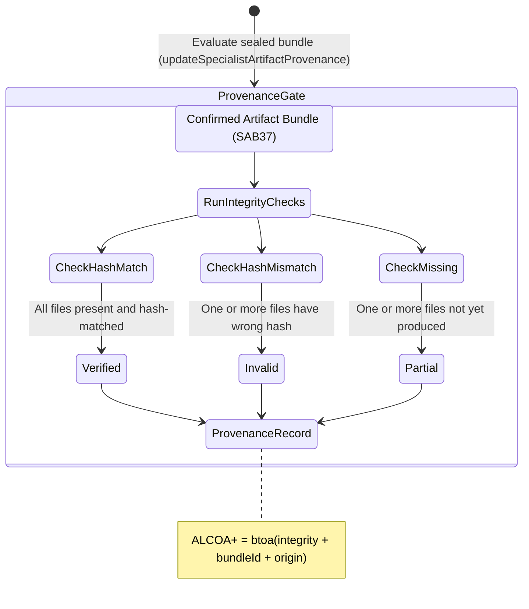

<!-- Diagram: 24-cpu-swarm-node-architecture -->
---
target_schema: prime-mermaid-v1
confidence: verification_gated
author: Grace Hopper (QA Diagrammer)
description: Formal topology governing the move from inspectable artifact bundles (SAB37) to tamper-evident provenance verification (Verified / Partial / Invalid).
context_paper: SI18 — Transparency as a Product Feature
---

# Structure: Specialist Artifact Provenance

Makes run outputs *trustworthy*. A bundle with correct filenames is not the same as a bundle with verified contents. This surface runs the provenance chain from manager directive through to per-file hash comparison, exposing exactly where trust breaks down.

## State Dictionary
- `RunIntegrityChecks`: Per-file sha256 hash comparison against expected manifest.
- `Verified`: All files present with matching hashes — bundle is promotable.
- `Partial`: At least one file not yet written — run still in progress.
- `Invalid`: At least one hash mismatch detected — bundle is untrusted.
- `ProvenanceRecord`: ALCOA+ stamped record carrying provenance chain and integrity verdict.
