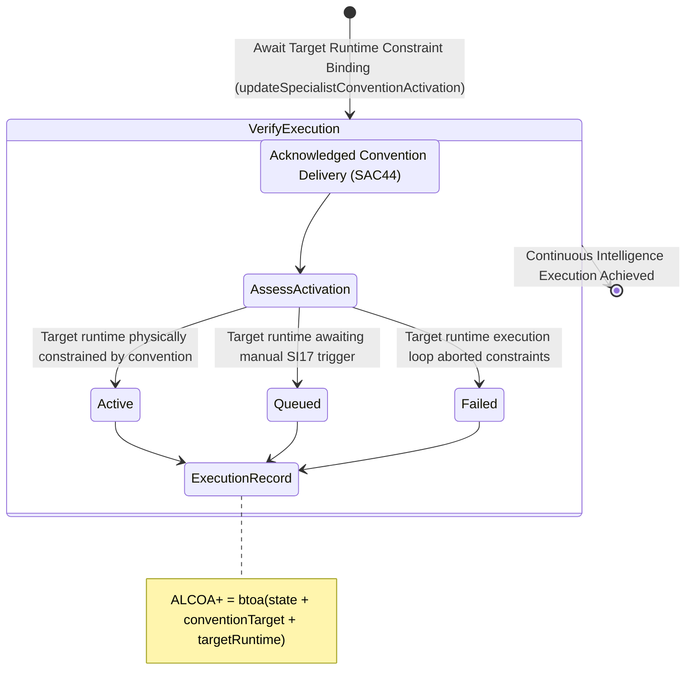

<!-- Diagram: 24-cpu-swarm-node-architecture -->
---
target_schema: prime-mermaid-v1
confidence: verification_gated
author: Grace Hopper (QA Diagrammer)
description: Formal topology mapping the final execution stage of a delivered convention actively constraining its target runtime (Active / Queued / Failed).
context_paper: SI21 — The Solace Intelligence System
---

# Structure: Specialist Convention Activation & Target Execution

The final cryptographic bond in the intelligence loop. This graph ensures the delivered convention goes beyond simple receipt parsing (SAC44) and actively governs the worker executing the target packet, establishing the continuous self-constraining motion of the System.

## State Dictionary
- `AssessActivation`: Verifies the worker runtime is physically interpreting the convention as bounds for execution.
- `Active`: The downstream worker execution loop is running under the explicit constraint of the delivered convention.
- `Queued`: The worker runtime is loaded with constraints but halted pending authority clearance.
- `Failed`: The worker crashed, drifted, or rejected the constraints during execution.
- `ExecutionRecord`: ALCOA+ ledger stamp proving continuous execution continuity.
