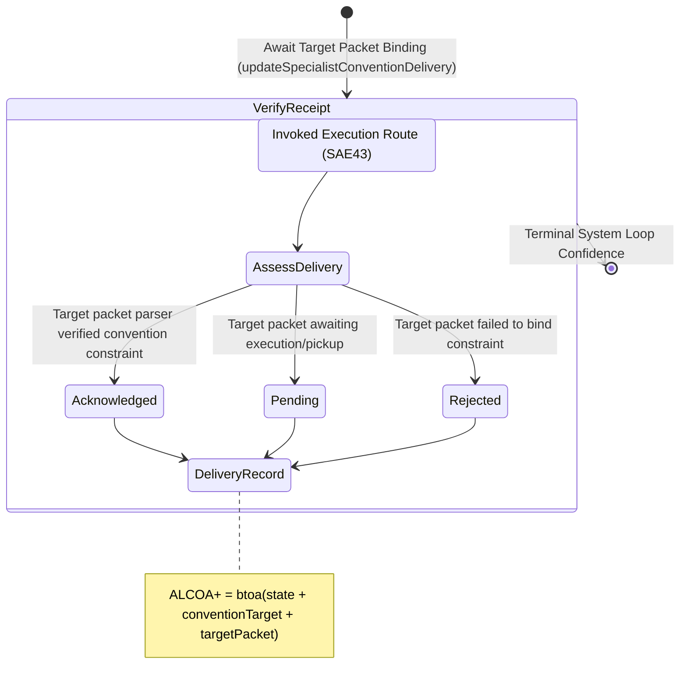

<!-- Diagram: 24-cpu-swarm-node-architecture -->
---
target_schema: prime-mermaid-v1
confidence: verification_gated
author: Grace Hopper (QA Diagrammer)
description: Formal topology mapping the final delivery receipt of an invoked convention to its target packet (Acknowledged / Pending / Rejected).
context_paper: SI21 — The Solace Intelligence System
---

# Structure: Specialist Convention Delivery Receipt

Closes the loop cryptographically. This graph ensures we do not just fire-and-forget routing invocations (SAE43), but verify that the receiving specialist agent actually acknowledged the convention constraint inside its execution boundary.

## State Dictionary
- `AssessDelivery`: Verifies if the target packet's runtime actually ingested the invoked memory object.
- `Acknowledged`: The downstream worker agent parsed and bound the convention as an active execution constraint.
- `Pending`: The packet is formed but the worker has not yet spun up its parse loop.
- `Rejected`: The target worker failed to bind the convention, halting intelligence continuity.
- `DeliveryRecord`: ALCOA+ ledger stamp proving intelligence outputs successfully constrained intelligence inputs.
