<!-- Diagram: 24-cpu-swarm-node-architecture -->
---
target_schema: prime-mermaid-v1
confidence: verification_gated
author: Grace Hopper (QA Diagrammer)
description: Formal topology mapping the terminal footprint evidence of an actively constrained runtime session, producing a measured output artifact (Visible / Partial / Absent).
context_paper: SI18 — Transparency as a Product Feature
---

# Structure: Specialist Convention Effect & Constrained Output

The absolute terminal state of the intelligence system loop. This graph verifies that the successfully bound memory constraint (SAC45) actually produced a measurable, visible difference in the final generated artifact. Without this, the system represents "effort" instead of "intelligence."

```mermaid
stateDiagram-v2
    [*] --> VerifyFootprint: Await Terminal Run Constraints (updateSpecialistConventionEffect)

    state VerifyFootprint {
        direction LR

        ActiveConstraint: Active Runtime Constraint (SAC45)
        ActiveConstraint --> AssessEffect

        AssessEffect --> Visible : Produced artifact conclusively matches constraint bounds
        AssessEffect --> Partial : Target aborted cleanly; intermediate artifacts present 
        AssessEffect --> Absent  : Target failed to generate footprint; constraints ignored

        Visible --> EffectRecord
        Partial --> EffectRecord
        Absent  --> EffectRecord

        note right of EffectRecord: ALCOA+ = btoa(state + targetRuntime + producedArtifact)
    }

    VerifyFootprint --> [*]: Intelligence Output Closed
```

## State Dictionary
- `AssessEffect`: Analyzes the final payload output to determine if the injected conventions measurably constrained the result.
- `Visible`: Ultimate proof of execution. The generated artifact cleanly reflects the active convention constraints.
- `Partial`: Execution suspended or halted prior to final closure. Intermediates exist but are not final truth.
- `Absent`: Terminal failure to exert intelligence system constraint.
- `EffectRecord`: Cryptographic ALCOA+ terminal stamp proving intelligence output bounds.
