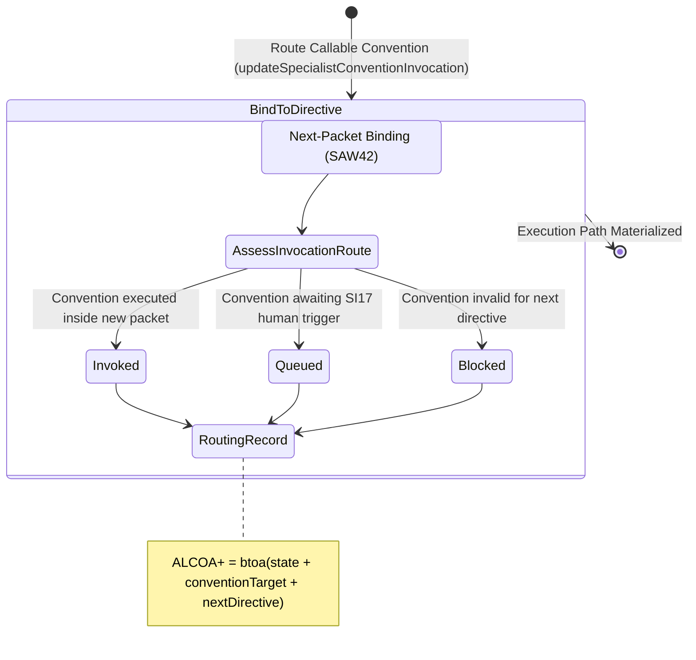

<!-- Diagram: 24-cpu-swarm-node-architecture -->
---
target_schema: prime-mermaid-v1
confidence: verification_gated
author: Grace Hopper (QA Diagrammer)
description: Formal topology mapping reusable department memory packets (SAW42) into actual execution contexts for the next objective (Invoked / Queued / Blocked).
context_paper: SI10 — The Solace Execution Graph
---

# Structure: Specialist Convention Invocation

Graph binding execution paths. This diagram governs how a memory convention is actually run—not just "reusable", but actively governed as a constraint on the next graph node execution step.

## State Dictionary
- `AssessInvocationRoute`: Maps the known callable convention into the physical inbox of the next directive.
- `Invoked`: Convention successfully injected into the next packet and execution has begun.
- `Queued`: Convention securely held pending manager/SI17 oversight before execution.
- `Blocked`: Routing failure; convention is incompatible with the requested directive.
- `RoutingRecord`: ALCOA+ ledger stamp capturing visible proof of output-to-input continuous execution.
