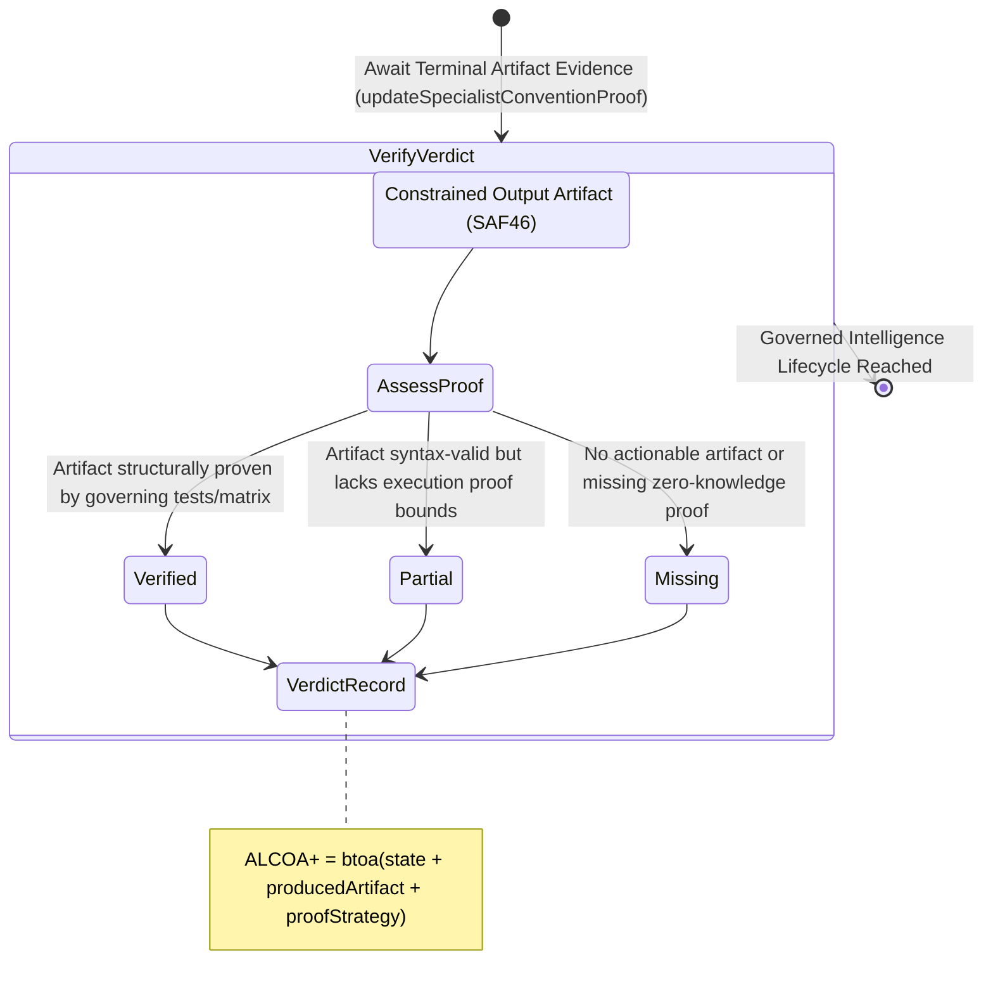

<!-- Diagram: 24-cpu-swarm-node-architecture -->
---
target_schema: prime-mermaid-v1
confidence: verification_gated
author: Grace Hopper (QA Diagrammer)
description: Formal topology mapping the overarching evidence verdict governing the final intelligence system constrained outputs (Verified / Partial / Missing).
context_paper: SI19 — Measuring Solace System Efficiency
---

# Structure: Specialist Convention Proof & Evidence Verdict

This represents the final audit barrier. Even if a convention actively alters an artifact (SAF46), Solace architecture requires that the modified artifact pass a recognized evidence strategy (unit tests, static proofs, formal bounds). Without an accepted *Verdict*, the artifacts cannot trigger downstream promotion logic.

## State Dictionary
- `AssessProof`: Evaluates the output artifact against the mandated proof strategy (e.g., PyTest suite, structural matrix).
- `Verified`: Absolute proof achieved. Artifact operates safely within bounds.
- `Partial`: Artifact is present and legible, but fails comprehensive deterministic proof constraints.
- `Missing`: Terminal error; the system cannot assess evidence because no footprint or proof exists.
- `VerdictRecord`: Final cryptographic ALCOA+ ledger stamp proving the integrity of the operating cycle.
