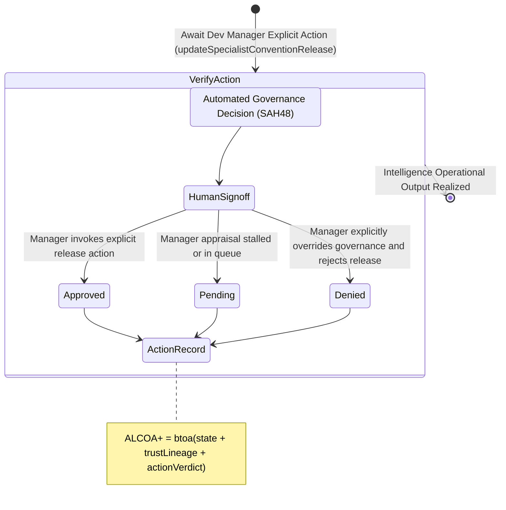

<!-- Diagram: 24-cpu-swarm-node-architecture -->
---
target_schema: prime-mermaid-v1
confidence: verification_gated
author: Grace Hopper (QA Diagrammer)
description: Formal topology mapping the explicit Dev Manager signoff action clearing the verified artifact lineage for production injection (Approved / Pending / Denied).
context_paper: SI17 — Human-in-the-Loop as a First-Class System Component
---

# Structure: Specialist Convention Release & Manager Signoff

This graph closes the physical Human-in-the-Loop boundary. An artifact can be proven (SAG47) and trusted by automated governance (SAH48), but the intelligence system requires one final explicit physical action from the supervising component (the Dev Manager) to trigger actual release and system injection.

## State Dictionary
- `HumanSignoff`: SI17 boundary where the human operator manually verifies and triggers deployment.
- `Approved`: Manager affirmatively signed off on the verification matrix. Component released into the wild.
- `Pending`: Payload is frozen awaiting a manual review cycle.
- `Denied`: Manager explicitly overruled automated checks. Run is binned.
- `ActionRecord`: Terminal ALCOA+ ledger stamp proving continuous execution continuity and human authorization bounds.
