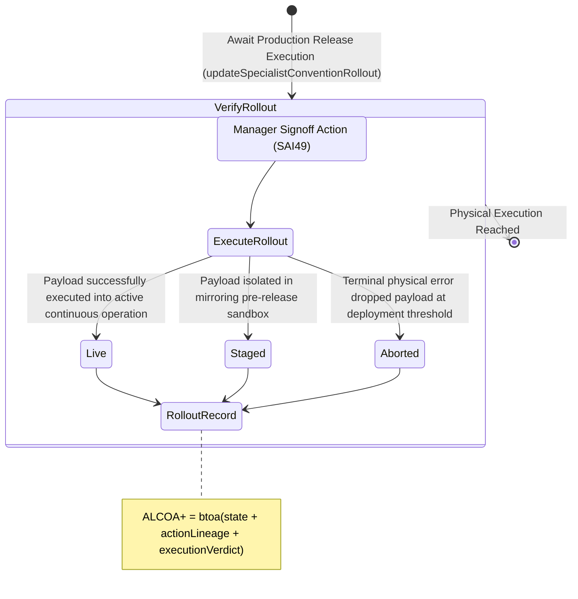

<!-- Diagram: 24-cpu-swarm-node-architecture -->
---
target_schema: prime-mermaid-v1
confidence: verification_gated
author: Grace Hopper (QA Diagrammer)
description: Formal topology mapping the extreme edge of the intelligence system where manager-approved lineage executes into physical target deployment (Live / Staged / Aborted).
context_paper: SI18 — Transparency as a Product Feature
---

# Structure: Specialist Convention Rollout & Release Execution

This represents absolute physical Ground Truth. Even overriding manager authorization (SAI49) means nothing if the execution step drops the payload. This node verifies whether the artifacts are definitively running in the deployed target system.

## State Dictionary
- `ExecuteRollout`: Purely mechanical action of delivering bits onto bare metal/target instances.
- `Live`: Deployment succeeded. Constraints running active and systemically.
- `Staged`: Deployment succeeded within restricted environment boundary. 
- `Aborted`: Deployment failed. Physical or environmental constraint violation block.
- `RolloutRecord`: Immutable ALCOA+ ledger stamp proving the cycle definitively moved intelligence from concept to physical system integration.
