<!-- Diagram: 24-cpu-swarm-node-architecture -->
---
target_schema: prime-mermaid-v1
confidence: verification_gated
author: Grace Hopper (QA Diagrammer)
description: Formal topology mapping the governance evaluation establishing definitive deployment or release readiness over a proven lineage (Trusted / Provisional / Blocked).
context_paper: SI21 — The Solace Intelligence System
---

# Structure: Specialist Convention Trust & Release Readiness

This represents the ultimate authoritative node spanning an entire worker execution footprint. A proven artifact verdict (SAG47) yields an operational fact, but *Convention Trust* translates that fact into a governance decision: Can this lineage be released, promoted, or committed to absolute systematic Department Memory?

```mermaid
stateDiagram-v2
    [*] --> VerifyReadiness: Await Governing Intelligence Appraisal (updateSpecialistConventionTrust)

    state VerifyReadiness {
        direction LR

        EvidenceVerdict: Governed Proof Verdict (SAG47)
        EvidenceVerdict --> AssessTrust

        AssessTrust --> Trusted     : All constraints met; lineage systemically sealed and ready for release
        AssessTrust --> Provisional : Constraints bypassed or partial; execution locked pending SI17 human oversight
        AssessTrust --> Blocked     : Mathematical or qualitative failure; dead execution node

        Trusted     --> DecisionRecord
        Provisional --> DecisionRecord
        Blocked     --> DecisionRecord

        note right of DecisionRecord: ALCOA+ = btoa(state + verdictLineage + decisionVerdict)
    }

    VerifyReadiness --> [*]: Executive Branch Closed
```

## State Dictionary
- `AssessTrust`: Governance engine translating verifiable facts into executable systemic policy limits.
- `Trusted`: Ultimate system green light. Lineage fully cleared for systemic absorption.
- `Provisional`: Lineage halted at governance boundary; awaits `Solace Dev Manager` physical clearance. 
- `Blocked`: Executive abort. Lineage is quarantined and permanently unpromotable.
- `DecisionRecord`: ALCOA+ ledger stamp declaring absolute operational governance authority.
