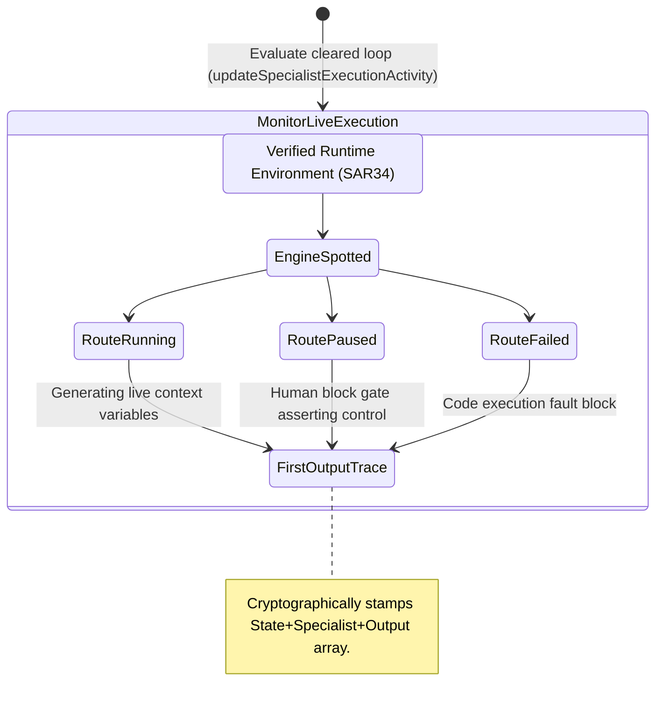

<!-- Diagram: 24-cpu-swarm-node-architecture -->
---
target_schema: prime-mermaid-v1
confidence: verification_gated
author: Grace Hopper (QA Diagrammer constraints)
description: Formal topology mapping the transition from cleared operational readiness (SAR34) into live observability of worker processes outputting data artifacts.
context_paper: SI18 Transparency as Product Feature
---

# Structure: Specialist Execution Activity

Enables total visibility over active workloads. This graph asserts that managers can visibly track the footprints of the execution sequence directly mapping out the live status and intermediate artifact generations.

## State Dictionary
- `ReadinessClearance`: A structural guarantee that dependencies permitted execution.
- `EngineSpotted`: Real-time node process watcher intercepting live standard output streams.
- `RouteRunning / RoutePaused / RouteFailed`: Observable and falsifiable state conditions resolving blindly trusted AI action.
- `FirstOutputTrace`: The ALCOA+ bound confirmation containing the actual output string matching the state.
