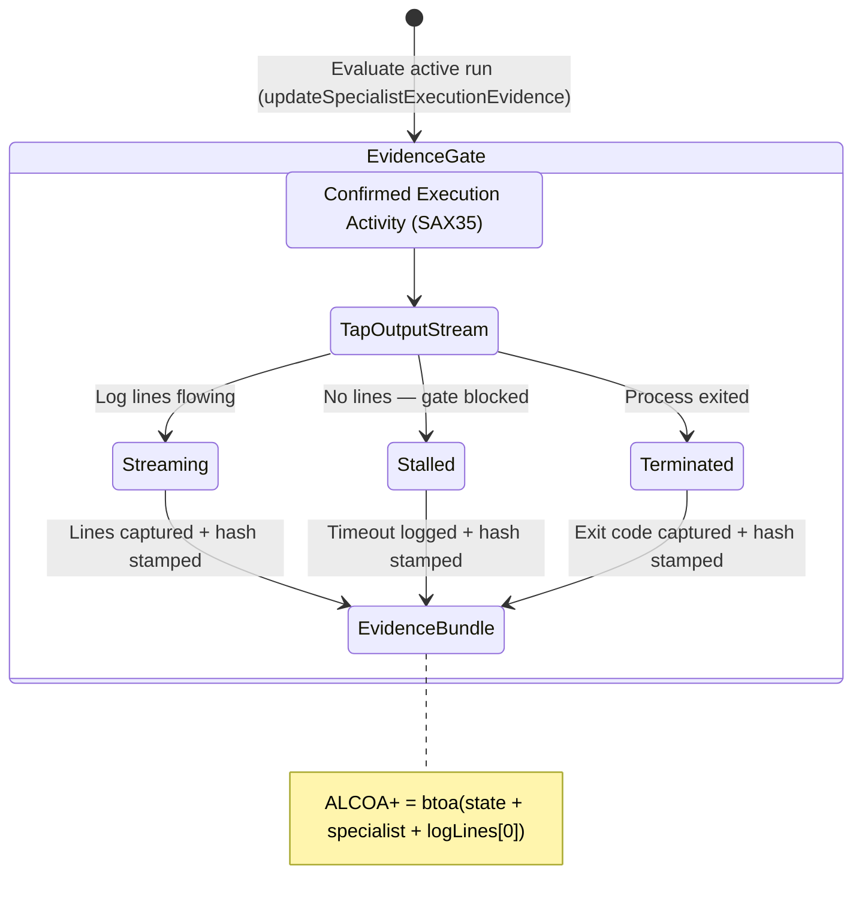

<!-- Diagram: 24-cpu-swarm-node-architecture -->
---
target_schema: prime-mermaid-v1
confidence: verification_gated
author: Grace Hopper (QA Diagrammer)
description: Formal topology governing the transition from live execution activity (SAX35) to inspectable output-log evidence streams (Streaming / Stalled / Terminated).
context_paper: SI18 — Transparency as a Product Feature
---

# Structure: Specialist Execution Evidence

Proves that running work is producing auditable artifacts. A worker that emits no output-log lines is indistinguishable from a stalled or ghosted process — this surface resolves that ambiguity by exposing the actual log context.

## State Dictionary
- `TapOutputStream`: Intercepts stdout/stderr from the worker process.
- `Streaming`: Active lines flowing — execution progressing normally.
- `Stalled`: Output blocked by a gate (e.g. awaiting upstream hash per SI17).
- `Terminated`: Process exited; final log line and exit code captured.
- `EvidenceBundle`: The ALCOA+ stamped record making the run auditable.
