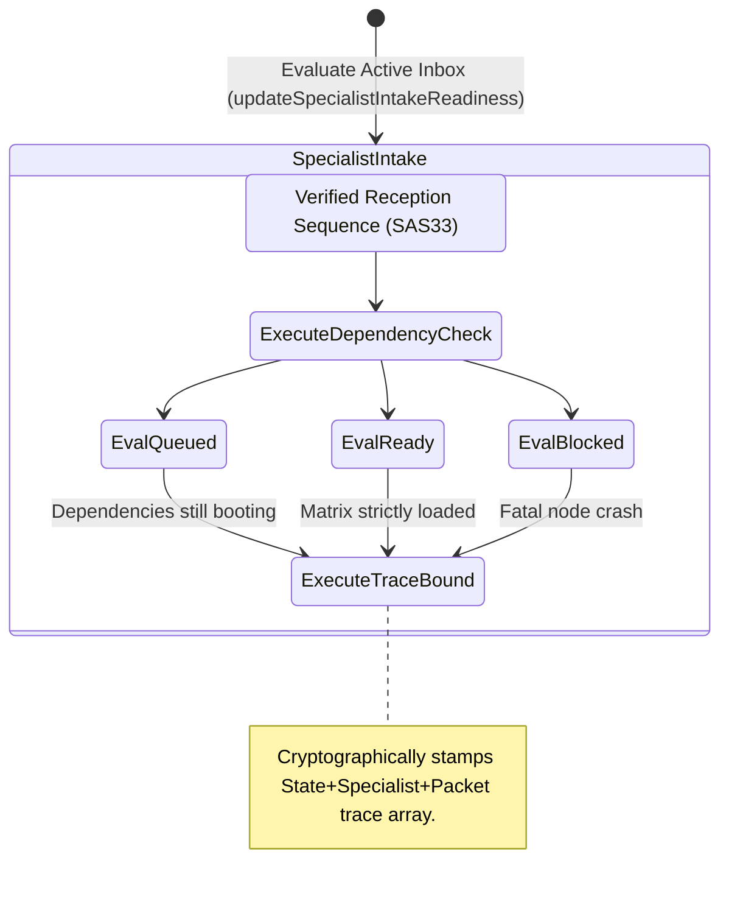

<!-- Diagram: 24-cpu-swarm-node-architecture -->
---
target_schema: prime-mermaid-v1
confidence: verification_gated
author: Grace Hopper (QA Diagrammer constraints)
description: Formal topology governing whether a successfully delivered packet (SAS33) clears Specialist Intake limitations, permitting genuine operational execution (Queued, Ready, Blocked).
context_paper: SI21 Solace Intelligence System
---

# Structure: Specialist Intake Readiness

Validating the execution bridge. An assigned task in a specialist inbox does not guarantee the required execution matrix is populated. This array verifies environment structures before turning on the engine lock.

## State Dictionary
- `AcceptedPacket`: The payload successfully placed in the lane's Inbox target.
- `ExecuteDependencyCheck`: The worker internal diagnostic node asserting dependencies.
- `EvalQueued / EvalReady / EvalBlocked`: Truthful pipeline states matching what a native environment is doing, rather than assuming it's running.
- `ExecuteTraceBound`: The ALCOA+ compliant signature gating execution starts.
