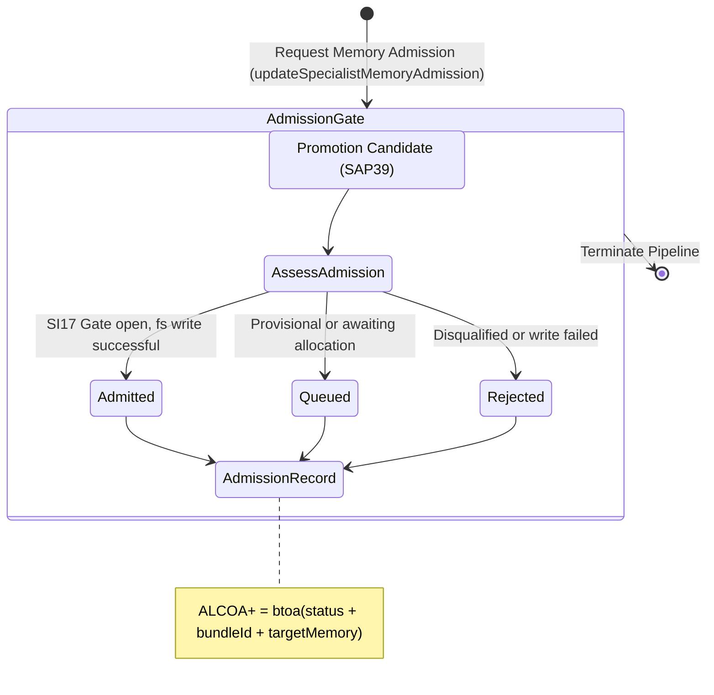

<!-- Diagram: 24-cpu-swarm-node-architecture -->
---
target_schema: prime-mermaid-v1
confidence: verification_gated
author: Grace Hopper (QA Diagrammer)
description: Formal topology governing the final admission of promotion-ready artifacts into department memory targets (Queued / Admitted / Rejected).
context_paper: SI21 — The Solace Intelligence System
---

# Structure: Specialist Memory Admission

Makes intelligence system retention *transparent*. This graph ensures that even if a bundle is promotion-ready, its actual write into the department memory queue and file system is explicitly tracked and verified.

## State Dictionary
- `AssessAdmission`: Evaluates if candidate cleared the SI17 seal gate.
- `Admitted`: Target memory address generated; artifacts persisted to tree.
- `Queued`: Awaiting final checks or manager gate approval.
- `Rejected`: Disqualified candidate blocked from writing to memory.
- `AdmissionRecord`: Final ALCOA+ ledger stamp for the pipeline sequence.
