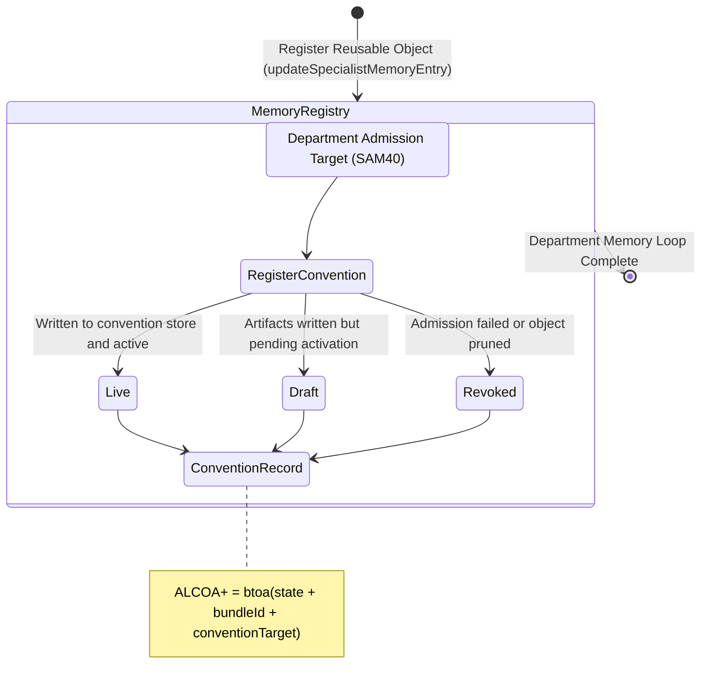

<!-- Diagram: 24-cpu-swarm-node-architecture -->
---
target_schema: prime-mermaid-v1
confidence: verification_gated
author: Grace Hopper (QA Diagrammer)
description: Formal topology tracking admitted run output artifacts as they become concrete, reusable department conventions and memory objects (Live / Draft / Revoked).
context_paper: SI21 — The Solace Intelligence System
---

# Structure: Specialist Memory Entry & Conventions

Makes the intelligence system *materially inspectable*. This graph ensures that once a run is admitted to memory (SAM40), it manifests as a concrete, reusable object in the convention store or filesystem, closing the loop from manager directive to department capability.

## State Dictionary
- `RegisterConvention`: The action of promoting admitted artifacts into reusable system objects.
- `Live`: The convention is fully registered and available to subsequent runs.
- `Draft`: Artifacts inhabit memory but lack final registration. 
- `Revoked`: The object was denied registration or subsequently purged.
- `ConventionRecord`: The ALCOA+ ledger stamp for the final memory object, bringing transparency to the end product.
