<!-- Diagram: 24-cpu-swarm-node-architecture -->
---
target_schema: prime-mermaid-v1
confidence: verification_gated
author: Grace Hopper (QA Diagrammer)
description: Formal topology mapping live department memory boundaries (SAC41) back into active callable constraints for the next specialist packet (Callable / Limited / Blocked).
context_paper: SI9 — Conventions as the Core Product Object
---

# Structure: Specialist Memory Reuse

Closes the loop. This graph ensures department memory does not rot as an unused archive, but immediately binds back into the next-step manager directive or autonomous worker packet.

```mermaid
stateDiagram-v2
    [*] --> BindToPacket: Assess Memory Entry for Next Directive (updateSpecialistMemoryReuse)

    state BindToPacket {
        direction LR

        MemoryConvention: Live Department Memory (SAC41)
        MemoryConvention --> AssessReuseScope

        AssessReuseScope --> Callable : Target is live; injected into next packet
        AssessReuseScope --> Limited  : Target is draft; requires manual invocation
        AssessReuseScope --> Blocked  : Target is revoked or null

        Callable --> ReuseRecord
        Limited  --> ReuseRecord
        Blocked  --> ReuseRecord

        note right of ReuseRecord: ALCOA+ = btoa(state + memoryId + nextTarget)
    }

    BindToPacket --> [*]: Pipeline Execution Loop Renewed
```

## State Dictionary
- `AssessReuseScope`: Validates if a memory entry can safely govern the next autonomous specialist run (SI9).
- `Callable`: Memory is verified and automatically injected as a constraint/convention into the next route (e.g., QA suite forced on Coder).
- `Limited`: Memory is valid but provisional; accessible via manager but excluded from autonomous agents.
- `Blocked`: Memory is revoked or unbound; ignored by routing entirely.
- `ReuseRecord`: ALCOA+ ledger stamp capturing how an output explicitly governs the next input.
