<!-- Diagram: 24-cpu-swarm-node-architecture -->
---
target_schema: prime-mermaid-v1
confidence: verification_gated
author: Grace Hopper (QA Diagrammer)
description: Formal topology mapping explicit incident closure verification checking whether systemic remediation truly restored continuous operational bounds (Verified Closed / Pending / Failed).
context_paper: SI21 — The Solace Intelligence System
---

# Structure: Specialist Post-Release Closure & Verification

Remediating an incident (`SAC52`) is an action; proving the action worked is verification (`SAC53`). This node governs the absolute final closure of the post-release operational tracking loop.

```mermaid
stateDiagram-v2
    [*] --> VerifyClosure: Await Operational Remediation Verification (updateSpecialistPostReleaseClosure)

    state VerifyClosure {
        direction LR

        RemediationVerdict: Active Remediation State (SAL52)
        RemediationVerdict --> VerificationCheck

        VerificationCheck --> VerifiedClosed  : Telemetry proves nominal bounds continuously held post-remediation.
        VerificationCheck --> Pending         : Remediation tracking active; insufficient telemetry to certify safety.
        VerificationCheck --> Failed          : Remediation failed. System degraded. Incident remains unmitigated.

        VerifiedClosed  --> ClosureRecord
        Pending         --> ClosureRecord
        Failed          --> ClosureRecord

        note right of ClosureRecord: ALCOA+ = btoa(state + incidentLineage + closureVerdict)
    }

    VerifyClosure --> [*]: Actionable Incident Sealed
```

## State Dictionary
- `VerificationCheck`: Structural confirmation that a deployed remediation action resulted in physical stability.
- `VerifiedClosed`: Root cause mitigated. System structurally restored. Incident sealed.
- `Pending`: Insufficient operational runtime to claim victory. Tracking holds the line.
- `Failed`: The applied remediation did not work. Degradation persists, looping back to unresolved incident severity.
- `ClosureRecord`: The immutable ALCOA+ ledger stamp proving the system honestly evaluates its own remediation efficacy.
