<!-- Diagram: 24-cpu-swarm-node-architecture -->
---
target_schema: prime-mermaid-v1
confidence: verification_gated
author: Grace Hopper (QA Diagrammer)
description: Formal topology mapping operational escalation checks guaranteeing failed remediation closures are mathematically tracked, never abandoned (Reopened / Escalated / Under Observation).
context_paper: SI21 — The Solace Intelligence System
---

# Structure: Specialist Post-Release Reopen & Escalation

A failed closure (`SAC53`) requires immediate systemic tracking to ensure the flaw is not merely swallowed into standard tracking. The pipeline catches these failures and governs their operational magnitude.

```mermaid
stateDiagram-v2
    [*] --> GovernEscalation: Await Closure Failure Signal (updateSpecialistPostReleaseEscalation)

    state GovernEscalation {
        direction LR

        ClosureVerdict: Remediation Verification Track (SAC53)
        ClosureVerdict --> IncidentGovernor

        IncidentGovernor --> UnderObservation : Pending execution verified; holding nominal tracking state.
        IncidentGovernor --> Reopened         : Closure definitively falsified. Incident demoted to active remediation.
        IncidentGovernor --> Escalated        : Successive panic detected. Total programmatic override/manual lock required.

        UnderObservation --> EscalationRecord
        Reopened         --> EscalationRecord
        Escalated        --> EscalationRecord

        note right of EscalationRecord: ALCOA+ = btoa(state + closureLineage + escalationVerdict)
    }

    GovernEscalation --> [*]: Operational Crisis Directed
```

## State Dictionary
- `IncidentGovernor`: Tracking subsystem enforcing operational management vectors over unresolved or suspended closures.
- `UnderObservation`: Default passive handling for valid pending states allowing standard metric decay observation.
- `Reopened`: Formal declaration that initial code execution/remediation actually failed bounds. Must do it again.
- `Escalated`: Immediate intervention requested. Extreme threat bounds violated prohibiting normal recursion.
- `EscalationRecord`: The immutable ALCOA+ ledger stamp proving the system responds definitively when its initial assumptions and remediations break in physical reality.
