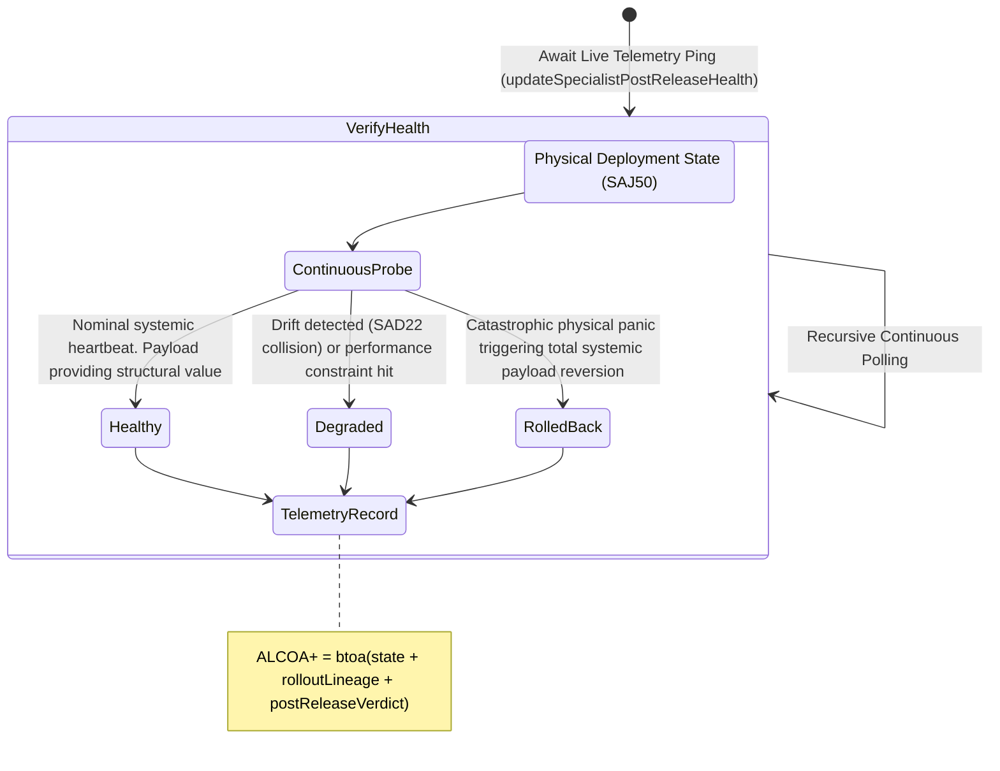

<!-- Diagram: 24-cpu-swarm-node-architecture -->
---
target_schema: prime-mermaid-v1
confidence: verification_gated
author: Grace Hopper (QA Diagrammer)
description: Formal topology mapping continuous operation tracking over target deployed physical runtime assets (Healthy / Degraded / Rolled Back).
context_paper: SI19 — Measuring Solace System Efficiency
---

# Structure: Specialist Post-Release Health & Rollback

This represents the eternal accountability node. Execution deployment (SAJ50) is a single event, but Post-Release Health dictates ongoing operational viability. When physics collides with theoretical code limits, this node forces the intelligence operation to sever or restrict the connection.

## State Dictionary
- `ContinuousProbe`: Eternal operational semantic/physical runtime polling evaluating the live artifact.
- `Healthy`: System operations nominal. Component successfully accelerating capabilities. 
- `Degraded`: Metric latency/sheer forces detected forcing the component into an at-risk remediation phase.
- `RolledBack`: Code failed systemic reality. Artifact was forcibly yanked back to its preceding state.
- `TelemetryRecord`: The resulting continuous ALCOA+ ledger stamp proving accountability across unbounded time.
