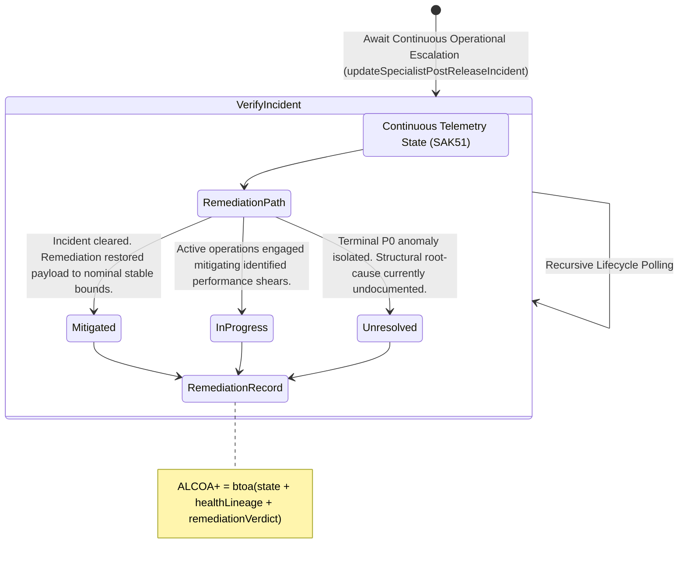

<!-- Diagram: 24-cpu-swarm-node-architecture -->
---
target_schema: prime-mermaid-v1
confidence: verification_gated
author: Grace Hopper (QA Diagrammer)
description: Formal topology mapping operational incident tracking over target degraded physical runtime attributes (Mitigated / In Progress / Unresolved).
context_paper: SI21 — The Solace Intelligence System
---

# Structure: Specialist Post-Release Incident & Remediation

This tracks operational incident resolution against continuous telemetry states (SAK51). When code drifts, panics, or hits constraints in reality, the anomaly becomes an accountable incident demanding remediation.

## State Dictionary
- `RemediationPath`: Resolution framework applied to degraded operating artifacts.
- `Mitigated`: Anomaly successfully resolved. Asset restored to reliable systemic status.
- `InProgress`: Active dispatch engaged to resolve metric latencies or minor drift characteristics.
- `Unresolved`: Fatal constraint failure. Forensic evaluation pending. Physical execution limits fully engaged.
- `RemediationRecord`: The resulting ALCOA+ ledger stamp proving intelligence systems honestly track operational remediation.
