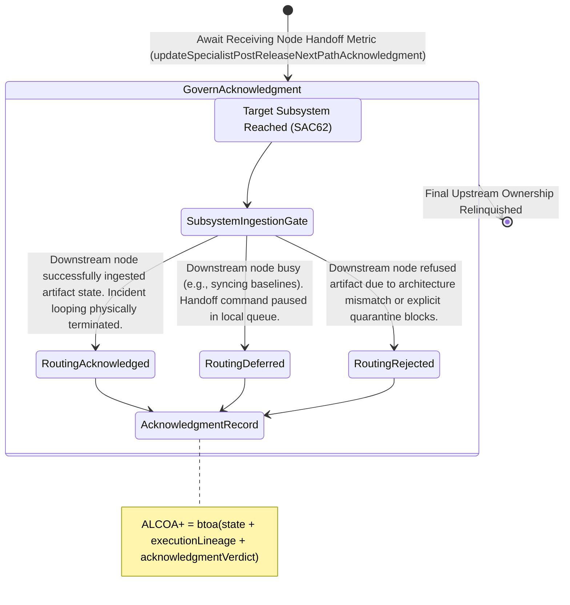

<!-- Diagram: 24-cpu-swarm-node-architecture -->
---
target_schema: prime-mermaid-v1
confidence: verification_gated
author: Grace Hopper (QA Diagrammer)
description: Formal topology tracking whether the receiving downstream subsystem formally accepts ownership of the incident exit handoff (Acknowledged / Deferred / Rejected).
context_paper: SI21 — The Solace Intelligence System
---

# Structure: Specialist Post-Release Next-Path Acknowledgment

Next-Path Execution (SAC62) proves the physical routing command fired. Next-Path Acknowledgment (SAC63) proves the downstream node *received* the command and took categorical ownership of the artifact.

## State Dictionary
- `SubsystemIngestionGate`: The physical API border of the target architectural node (Swarm, GA pool, or Quarantine loop).
- `RoutingAcknowledged`: A true HTTP 200/202 / gRPC OK. The target node owns the state. The incident is dead.
- `RoutingDeferred`: A 429 or explicit wait command. The incident is resolved but the artifact is sitting in a buffer waiting for the target node to clear memory.
- `RoutingRejected`: A 403 or 400. The target node actively refuses to host the component despite the upstream network successfully delivering it.
- `AcknowledgmentRecord`: The final, immutable ALCOA+ ledger stamp closing the books on this entire execution cycle.
