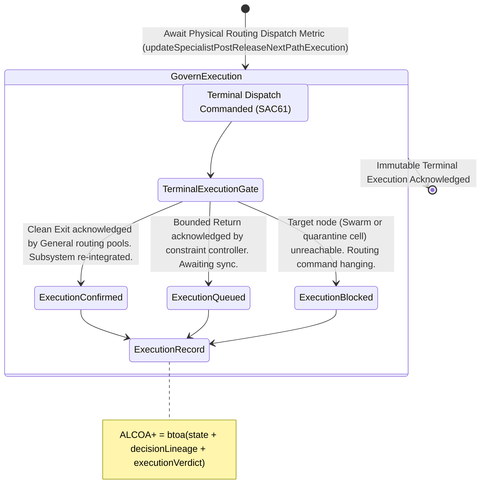

<!-- Diagram: 24-cpu-swarm-node-architecture -->
---
target_schema: prime-mermaid-v1
confidence: verification_gated
author: Grace Hopper (QA Diagrammer)
description: Formal topology tracking the definitive network execution of the terminal incident routing command (Confirmed / Queued / Blocked).
context_paper: SI21 — The Solace Intelligence System
---

# Structure: Specialist Post-Release Next-Path Execution

Next-Path Decision (SAC61) commands the final physical routing state to exit an incident. Next-Path Execution (SAC62) proves whether that command actually fired perfectly across the physical network layer.

## State Dictionary
- `TerminalExecutionGate`: The active sentinel tracking whether the ordered next-path commands correctly propagated through the physical machine boundaries.
- `ExecutionConfirmed`: The target state perfectly mapped to the network response. Traffic routing cleanly executed.
- `ExecutionQueued`: The command is valid but the target subsystem (e.g. Staged Recovery constraint loop) is currently processing baseline resets.
- `ExecutionBlocked`: The command fired but hit a brick wall. Target node is down, disconnected, or manually blocked by higher-order human intercepts.
- `ExecutionRecord`: The immutable ALCOA+ ledger stamp proving exactly what physically resulted from the terminal routing command.
