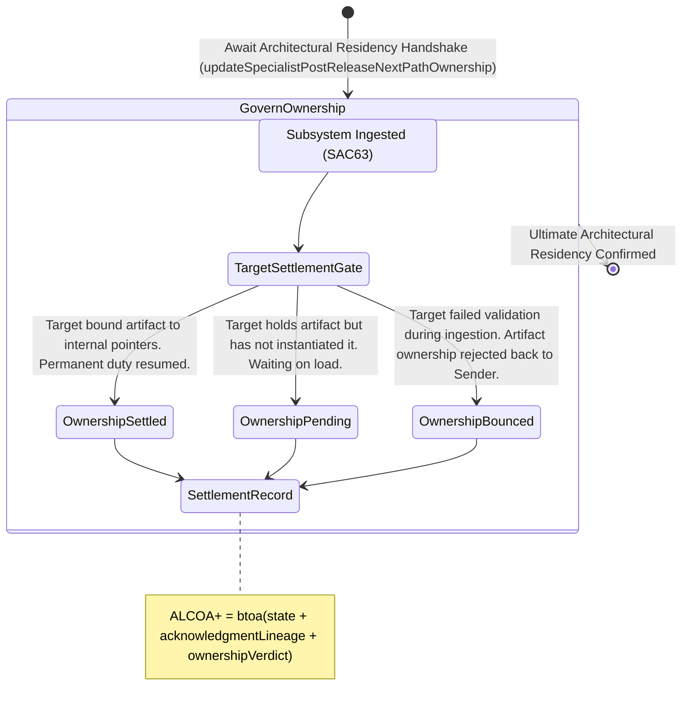

<!-- Diagram: 24-cpu-swarm-node-architecture -->
---
target_schema: prime-mermaid-v1
confidence: verification_gated
author: Grace Hopper (QA Diagrammer)
description: Formal topology tracking whether the receiving downstream subsystem formally integrates and permanently assumes structural ownership of the returned artifact (Settled / Pending / Bounced).
context_paper: SI21 — The Solace Intelligence System
---

# Structure: Specialist Post-Release Next-Path Ownership

Next-Path Acknowledgment (SAC63) proves the target node took immediate custody of the state handoff. Next-Path Ownership (SAC64) proves whether that node then successfully incorporated the artifact into its permanent running topology.

## State Dictionary
- `TargetSettlementGate`: The structural sentinel tracking whether an artifact actually boots and integrates inside its new host environment.
- `OwnershipSettled`: The explicit, final clean bill of health. The artifact is running, bound to pointers, and the upstream nodes are free to drop their memory bounds.
- `OwnershipPending`: The artifact is sitting safely in the target's internal queue but is not yet operational (e.g., waiting for next tick or scaling threshold).
- `OwnershipBounced`: A critical failure during integration. The target ingested it but could not boot it. Ownership bounces back to the upstream Incident command.
- `SettlementRecord`: The absolute final, immutable ALCOA+ ledger stamp for an artifact's incident lifecycle.
