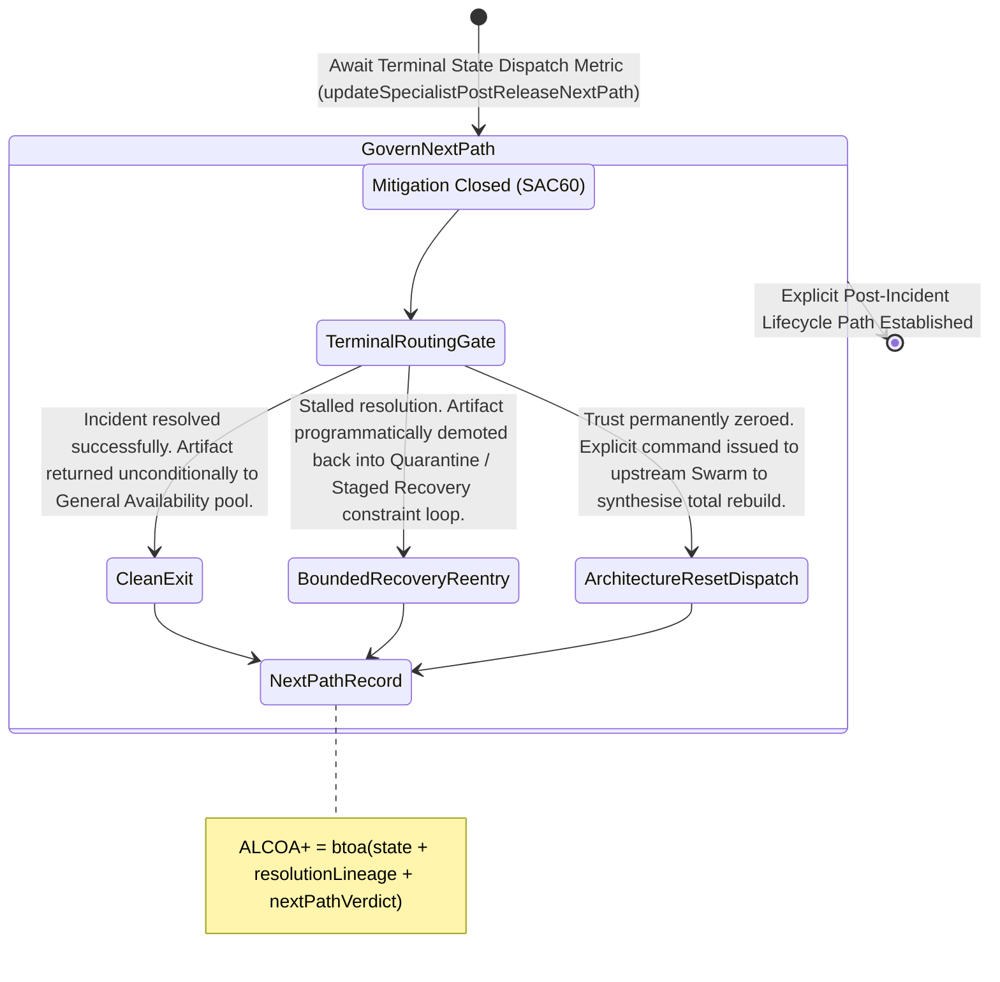

<!-- Diagram: 24-cpu-swarm-node-architecture -->
---
target_schema: prime-mermaid-v1
confidence: verification_gated
author: Grace Hopper (QA Diagrammer)
description: Formal topology mapping explicit terminal intelligence routing following relapse resolution (Clean Exit / Bounded Recovery / Reset Dispatch).
context_paper: SI21 — The Solace Intelligence System
---

# Structure: Specialist Post-Release Next-Path Decision

Regression Resolution (SAC60) dictates what logically happened at the end of the mitigation. Next-Path Decision (SAC61) dictates the explicit operational command executed to move the affected artifact into its terminal post-incident phase.

## State Dictionary
- `TerminalRoutingGate`: The active control node issuing the final physical command closing the regression/incident cycle.
- `CleanExit`: The artifact is cleared to resume standard routing operations, completely escaping the relapse loop.
- `BoundedRecoveryReentry`: The artifact is formally re-inserted into Phase 1 control mechanisms designed for volatile structures.
- `ArchitectureResetDispatch`: The artifact is dead. A physical, programmatic command is sent to the developer swarm to rewrite it.
- `NextPathRecord`: The immutable ALCOA+ ledger stamp proving exactly what command closed the investigation.
