<!-- Diagram: 24-cpu-swarm-node-architecture -->
---
target_schema: prime-mermaid-v1
confidence: verification_gated
author: Grace Hopper (QA Diagrammer)
description: Formal topology mapping explicit operational control blockades imposed when incidents severely escalate (Quarantined / Manual Override Required / Constrained Continuation).
context_paper: SI21 — The Solace Intelligence System
---

# Structure: Specialist Post-Release Quarantine & Override

When an incident escalates (`SAC54`) past all automated resolution boundaries, the system must assert total physical restraint. Quarantine is the final, unbreakable fail-safe.

```mermaid
stateDiagram-v2
    [*] --> GovernControl: Await Escalation Trigger (updateSpecialistPostReleaseQuarantine)

    state GovernControl {
        direction LR

        EscalationVerdict: Escalation Path (SAC54)
        EscalationVerdict --> QuarantineGovernor

        QuarantineGovernor --> ConstrainedContinuation : Severe limits passively accommodated; bounds constrained but active.
        QuarantineGovernor --> ManualOverrideRequired  : Automated cycles locked. Explicit human instruction demanded.
        QuarantineGovernor --> Quarantined             : Terminal P0. Complete component isolation. Network/execution severed.

        ConstrainedContinuation --> ControlRecord
        ManualOverrideRequired  --> ControlRecord
        Quarantined             --> ControlRecord

        note right of ControlRecord: ALCOA+ = btoa(state + escalationLineage + controlVerdict)
    }

    GovernControl --> [*]: Severe Anomaly Operationally Secured
```

## State Dictionary
- `QuarantineGovernor`: The final physical constraint layer assessing whether an escalated artifact represents systemic danger.
- `ConstrainedContinuation`: Operations permitted to proceed only under extreme monitoring and tightly restricted resource ceilings.
- `ManualOverrideRequired`: The loop cannot resolve itself. Execution frozen until a biologically authenticated or explicit key signs off.
- `Quarantined`: Absolute blockade. The code is isolated from all surrounding systems to prevent catastrophic cascade or data contamination.
- `ControlRecord`: The immutable ALCOA+ ledger stamp proving the system successfully identified, tracked, escalated, and correctly neutered a physically failing deployment.
