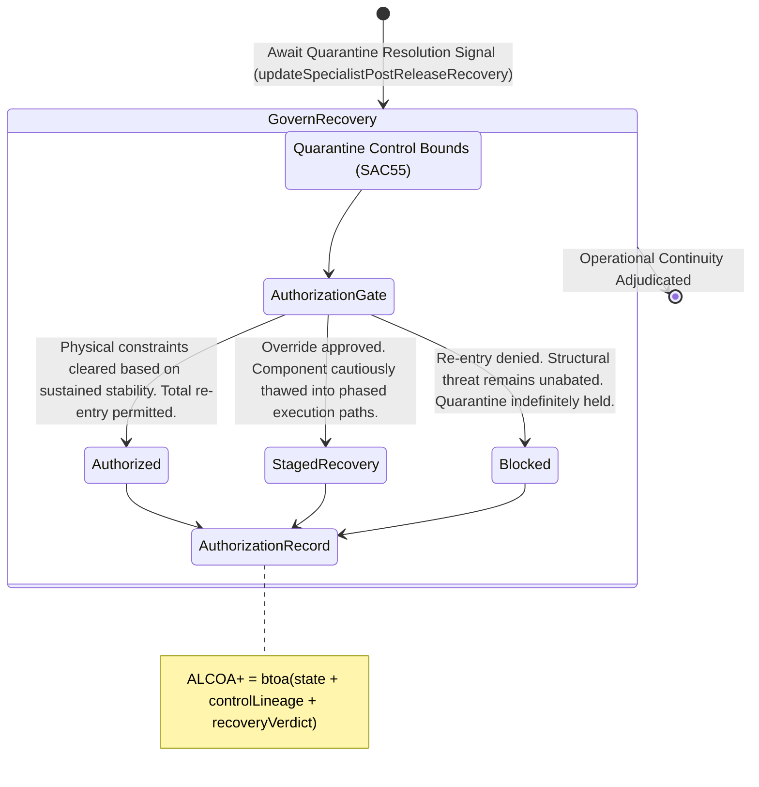

<!-- Diagram: 24-cpu-swarm-node-architecture -->
---
target_schema: prime-mermaid-v1
confidence: verification_gated
author: Grace Hopper (QA Diagrammer)
description: Formal topology mapping operational recovery gates ensuring artifacts escaping quarantine are verifiably authorized for systemic re-entry (Authorized / Staged Recovery / Blocked).
context_paper: SI21 — The Solace Intelligence System
---

# Structure: Specialist Post-Release Recovery Authorization

Quarantine (`SAC55`) halts failure; Recovery Authorization (`SAC56`) manages the safe, proven return to operational normalcy. An artifact cannot merely "time out" of quarantine; survival forces an explicit gate.

## State Dictionary
- `AuthorizationGate`: The final verification check evaluating if an isolated anomaly requires continued quarantine or can be trusted again.
- `Authorized`: Proven harmless or successfully stabilized. Artifact restored to Tier 1 operational standing.
- `StagedRecovery`: Re-entry allowed, starting at Tier 3 constrained routing, stepping upward conditionally based on ongoing telemetry.
- `Blocked`: Artifact remains deeply flawed. Total blockade enforced; anomaly permanently sequestered.
- `AuthorizationRecord`: The immutable ALCOA+ ledger stamp proving the system formally authorizes re-entry vectors out of physical quarantine.
