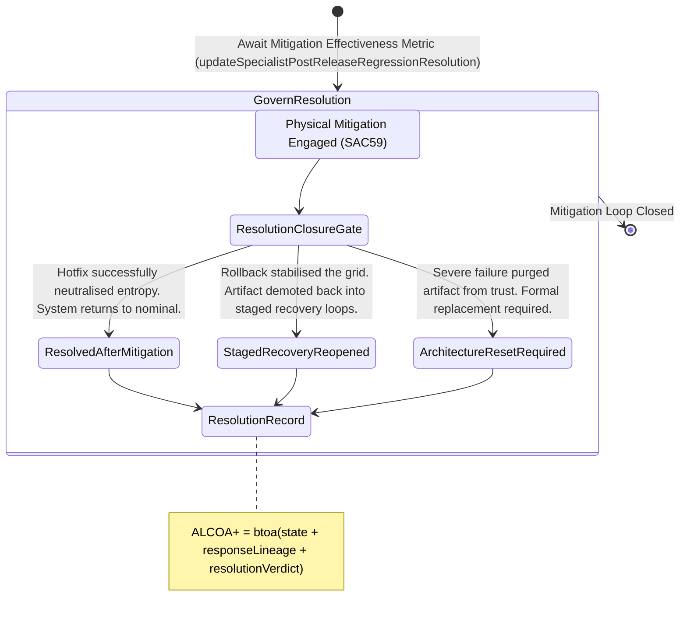

<!-- Diagram: 24-cpu-swarm-node-architecture -->
---
target_schema: prime-mermaid-v1
confidence: verification_gated
author: Grace Hopper (QA Diagrammer)
description: Formal topology mapping how physical mitigation responses are closed out or recursively escalated (Resolved / Staged Recovery / Architecture Reset).
context_paper: SI21 — The Solace Intelligence System
---

# Structure: Specialist Post-Release Regression Resolution

Regression Response (SAC59) dictates what the system *did* to fight the relapse. Regression Resolution (SAC60) dictates how that skirmish *ended* and feeds back into the macroscopic network state.

## State Dictionary
- `ResolutionClosureGate`: The active control node deciding if the executed regression response successfully contained the anomaly.
- `ResolvedAfterMitigation`: Best-case exit. A live hotfix managed to squash the bug without severe routing disruptions. Incident officially closed.
- `StagedRecoveryReopened`: Fallback loop. An aggressive rollback severed the defect, but the artifact is given another chance via demotion back to Staged Recovery unfreezing limits.
- `ArchitectureResetRequired`: Terminal loop. The component is entirely purged from the system graph. Deep structural rewrite required from scratch.
- `ResolutionRecord`: The immutable ALCOA+ ledger stamp proving exactly how the system exited a relapse mitigation cycle.
