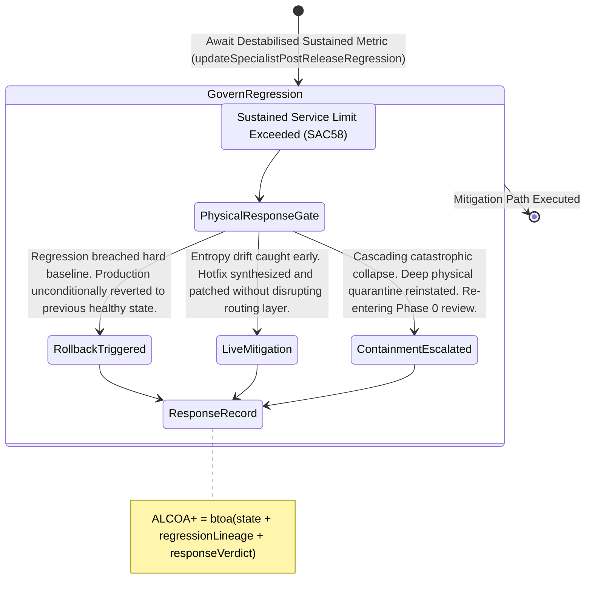

<!-- Diagram: 24-cpu-swarm-node-architecture -->
---
target_schema: prime-mermaid-v1
confidence: verification_gated
author: Grace Hopper (QA Diagrammer)
description: Formal topology mapping physical intelligence responses to systemic relapses after quarantine escapes (Rollback / Live Mitigation / Containment).
context_paper: SI21 — The Solace Intelligence System
---

# Structure: Specialist Post-Release Regression Response

Sustained Service Validation (`SAC58`) flags if an anomaly persists or relapses over time. Regression Response (`SAC59`) dictates the physical, governed action the system executes to combat that relapse.

## State Dictionary
- `PhysicalResponseGate`: The active control node triggered when a recovering artifact statistically fails its long-term baseline checks.
- `RollbackTriggered`: The system severs the bleeding node instantly by shifting routing logic back to the last known mathematically pure commit.
- `LiveMitigation`: The anomaly is small enough to be dynamically squashed by an over-the-air hotfix while the node remains in service.
- `ContainmentEscalated`: The most severe regression response. The entire sub-tree is quarantined and locked from execution pending a human architectural reset.
- `ResponseRecord`: The immutable ALCOA+ ledger stamp proving what precise physical action the system took against the regression.
