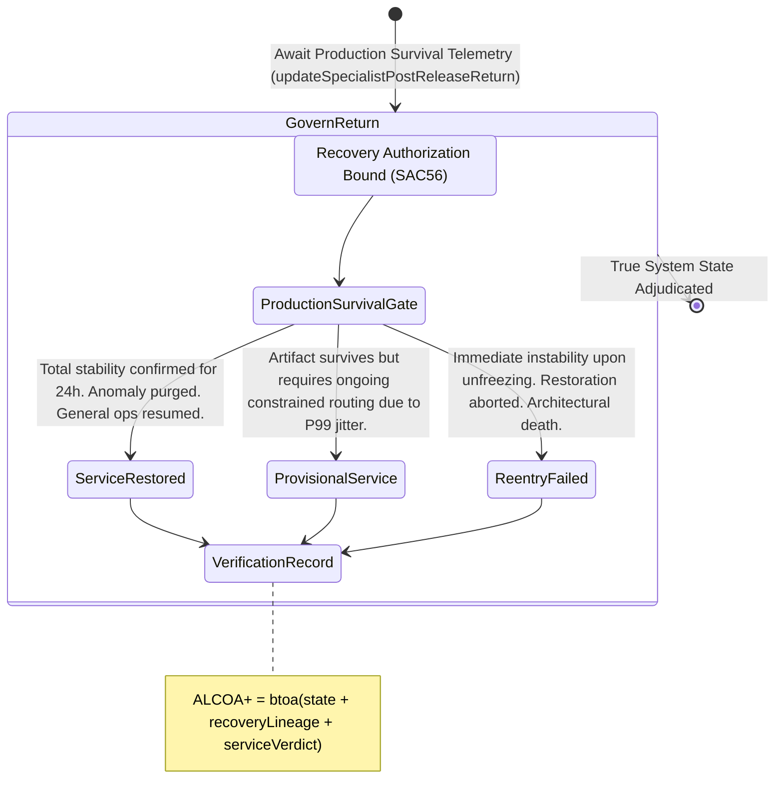

<!-- Diagram: 24-cpu-swarm-node-architecture -->
---
target_schema: prime-mermaid-v1
confidence: verification_gated
author: Grace Hopper (QA Diagrammer)
description: Formal topology mapping operational return-to-service checks proving artifacts genuinely survive physical production after quarantine exit (Service Restored / Provisional Service / Re-entry Failed).
context_paper: SI21 — The Solace Intelligence System
---

# Structure: Specialist Post-Release Return-to-Service Verification

Recovery Authorization (`SAC56`) grants permission to run; Return-to-Service Verification (`SAC57`) measures whether that run actually succeeded or immediately degraded the network again. 

## State Dictionary
- `ProductionSurvivalGate`: The active measurement layer auditing whether an authorized recovery artifact remains structurally sound in physical reality.
- `ServiceRestored`: Final successful closure of the entire incident loop. Component operates nominally and is cleared.
- `ProvisionalService`: Acknowledges partial restoration where code holds limits but exhibits sufficient variance to block total unconditional release.
- `ReentryFailed`: Terminal failure. The recovered component immediately crashed or cascaded. It is permanently decommissioned for deep rewrite.
- `VerificationRecord`: The immutable ALCOA+ ledger stamp proving the system empirically measured physical stabilization before closing the anomaly loop.
