<!-- Diagram: 24-cpu-swarm-node-architecture -->
---
target_schema: prime-mermaid-v1
confidence: verification_gated
author: Grace Hopper (QA Diagrammer)
description: Formal topology mapping operational sustained-service checks proving recovering artifacts hold long-term structural integrity (Stable Service / Regression Watch / Relapse Detected).
context_paper: SI21 — The Solace Intelligence System
---

# Structure: Specialist Post-Release Sustained Service Validation

Return To Service (`SAC57`) proves immediate survivability; Sustained Service Validation (`SAC58`) proves systemic persistence. Code does not "work", it survives time.

```mermaid
stateDiagram-v2
    [*] --> GovernSustained: Await Extended Operational Validation (updateSpecialistPostReleaseSustained)

    state GovernSustained {
        direction LR

        ReturnVerdict: Return Service Survival Gate (SAC57)
        ReturnVerdict --> SustainedValidationGate

        SustainedValidationGate --> StableService   : Zero regressions detected across full 7-day extended operational matrix.
        SustainedValidationGate --> RegressionWatch : Minor metric jitter continuing; artifact held in adversarial monitoring loop.
        SustainedValidationGate --> RelapseDetected : Cascading failure emerged outside primary mitigation window. Severe regression.

        StableService   --> ValidationRecord
        RegressionWatch --> ValidationRecord
        RelapseDetected --> ValidationRecord

        note right of ValidationRecord: ALCOA+ = btoa(state + returnLineage + sustainedVerdict)
    }

    GovernSustained --> [*]: Deep Temporal Stability Adjudicated
```

## State Dictionary
- `SustainedValidationGate`: The long-baseline measurement layer auditing whether restored artifacts hold up to extended physical production friction.
- `StableService`: Final successful decoupling. The incident loop has fundamentally closed. Artifact survives the extended matrix.
- `RegressionWatch`: Persistent but non-fatal entropy accumulation locks the system in extended observation rather than unconditionally trusting the recovery.
- `RelapseDetected`: A latent, time-delayed fracture triggered a new panic. The previous remediation officially failed over the long-term baseline.
- `ValidationRecord`: The immutable ALCOA+ ledger stamp proving the system empirically measured long-term physical persistence before clearing the node.
