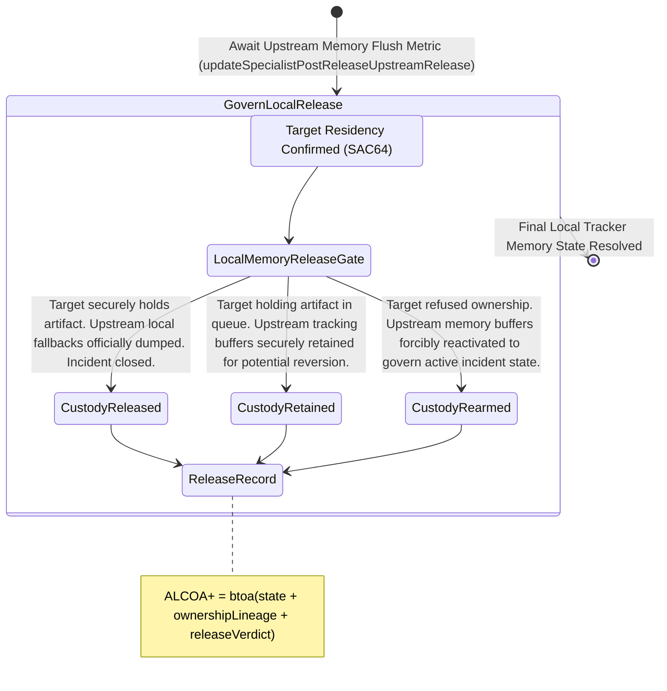

<!-- Diagram: 24-cpu-swarm-node-architecture -->
---
target_schema: prime-mermaid-v1
confidence: verification_gated
author: Grace Hopper (QA Diagrammer)
description: Formal topology tracking whether the upstream incident command node explicitly flushes its local memory and closes the loop (Released / Retained / Re-armed).
context_paper: SI21 — The Solace Intelligence System
---

# Structure: Specialist Post-Release Upstream Release

Next-Path Ownership (SAC64) proves the downstream node permanently accepted the artifact. Upstream Release (SAC65) proves the original sender successfully deleted its backup buffers, bringing the incident state count fully back to zero.

## State Dictionary
- `LocalMemoryReleaseGate`: The physical boundary within the sender representing its local memory and tracking pointers holding the artifact "just in case".
- `CustodyReleased`: The tracking pointer is deleted. The upstream loop has zero operational memory of the incident. It is a true closed chapter.
- `CustodyRetained`: The upstream pointer remains open but asleep, waiting for the downstream staging queue to clear.
- `CustodyRearmed`: The downstream explicitly crashed. The upstream tracking pointer wakes up and immediately resumes active mitigation loop processing.
- `ReleaseRecord`: The immutable ALCOA+ ledger stamp proving the sender successfully dropped the bag.
