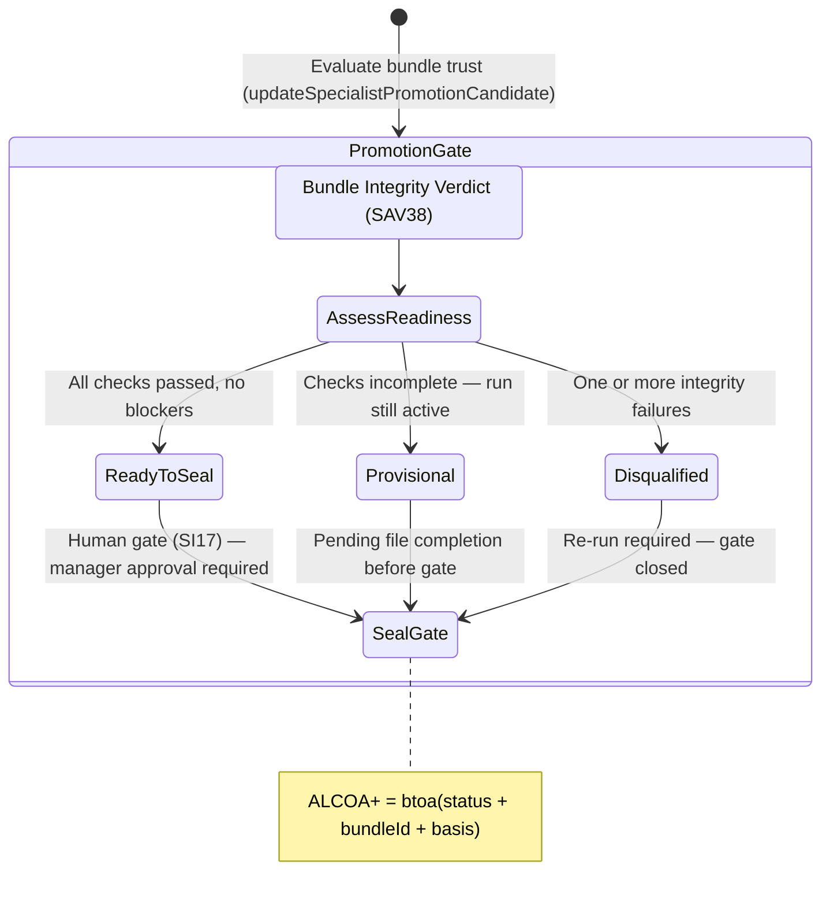

<!-- Diagram: 24-cpu-swarm-node-architecture -->
---
target_schema: prime-mermaid-v1
confidence: verification_gated
author: Grace Hopper (QA Diagrammer)
description: Formal topology governing the transition from verified artifact provenance (SAV38) to actionable promotion candidacy (Ready-to-Seal / Provisional / Disqualified).
context_paper: SI17 — Human-in-the-Loop as a First-Class System Component
---

# Structure: Specialist Promotion Candidate

Makes bundle trust *actionable*. This graph ensures that once integrity is verified, the workspace explicitly decides whether the run output is ready to enter department memory — and shows the exact gate or blocker preventing it if not.

## State Dictionary
- `AssessReadiness`: Combines provenance verdict with run completion state.
- `Ready-to-Seal`: All files present and hash-matched; bundle awaits human approval.
- `Provisional`: Provenance partially complete; run still producing outputs.
- `Disqualified`: Hash mismatch or missing file detected; cannot be promoted.
- `SealGate`: The SI17 human-in-the-loop checkpoint before committing to department memory.
