# Worker Assignment Packet Visibility Flow

Governs: how the workspace surfaces explicit task statements, scope locks, and expected evidence contracts for the active Dev context without relying on inference.

```mermaid
flowchart TD
    A[Worker Context Updates] --> B[updateWorkerDetail]
    B --> C[updateWorkerAssignmentPacket]
    
    C --> D{Resolve Active Role}
    D -->|manager| E[Manager Assignment]
    D -->|design| F[Design Assignment]
    D -->|coder| G[Coder Assignment]
    D -->|qa| H[QA Assignment]
    
    E -->|Statement| E_S["Triage requests & assign roles"]
    E -->|Evidence| E_E["manager-to-design-handoff.md\nProject map updates"]

    F -->|Statement| F_S["Translate assignments to architecture"]
    F -->|Evidence| F_E["design-to-coder-handoff.md\nPrime Mermaid diagrams"]

    G -->|Statement| G_S["Implement design handoff strictly"]
    G -->|Evidence| G_E["coder-to-qa-handoff.md\nSource code diffs\nPassing tests"]

    H -->|Statement| H_S["Verify coder implementation"]
    H -->|Evidence| H_E["qa-signoffs record\nBug triage logs"]

    E_S & F_S & G_S & H_S --> I[Scope Policy: FAIL_AND_NEW_TASK]
    E_E & F_E & G_E & H_E --> I

    I --> J[Render dev-worker-assignment-packet-card]
    J --> K[Show active app / role / run context]
    J --> L[Show visible packet basis and outbox root]
    
    style J fill:#1e293b,stroke:#818cf8,stroke-width:2px
```

