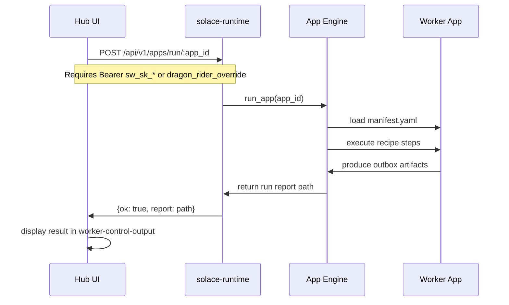

# Worker Control Flow

Governs: the worker run/control path from the Hub UI to the runtime app engine.

```mermaid
sequenceDiagram
    participant U as Hub UI
    participant RT as solace-runtime
    participant AE as App Engine
    participant W as Worker App

    U->>RT: POST /api/v1/apps/run/:app_id
    Note over U,RT: Requires Bearer sw_sk_* or dragon_rider_override

    RT->>AE: run_app(app_id)
    AE->>W: load manifest.yaml
    AE->>W: execute recipe steps
    W->>AE: produce outbox artifacts
    AE->>RT: return run report path

    RT->>U: {ok: true, report: path}
    U->>U: display result in worker-control-output
```
