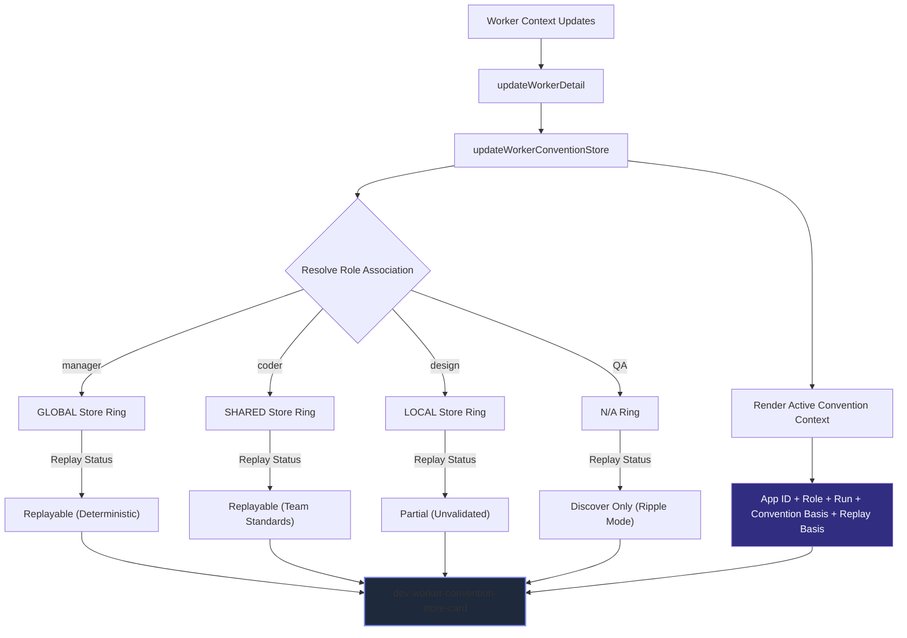

# Convention Store Binding Flow

Governs: how the workspace maps active workers to the persistent intelligence Convention Store layers (SI14).

```mermaid
flowchart TD
    A[Worker Context Updates] --> B[updateWorkerDetail]
    B --> C[updateWorkerConventionStore]
    C --> C0[Render Active Convention Context]
    
    C --> D{Resolve Role Association}
    D -->|manager| E_GLOB[GLOBAL Store Ring]
    D -->|coder| E_SHAR[SHARED Store Ring]
    D -->|design| E_LOC[LOCAL Store Ring]
    D -->|QA| E_NULL[N/A Ring]

    E_GLOB -->|Replay Status| GLOB_R["Replayable (Deterministic)"]
    E_SHAR -->|Replay Status| SHAR_R["Replayable (Team Standards)"]
    E_LOC -->|Replay Status| LOC_R["Partial (Unvalidated)"]
    E_NULL -->|Replay Status| NULL_R["Discover Only (Ripple Mode)"]

    C0 --> C1["App ID + Role + Run + Convention Basis + Replay Basis"]
    GLOB_R --> UI[dev-worker-convention-store-card]
    SHAR_R --> UI
    LOC_R --> UI
    NULL_R --> UI
    C1 --> UI

    classDef forbidden fill:#ffefef,stroke:#cc0000,stroke-width:2px
    classDef pass fill:#e8f5e9,stroke:#2e7d32,stroke-width:2px
    classDef gate fill:#fff9c4,stroke:#f9a825,stroke-width:2px
    
    style UI fill:#1e293b,stroke:#818cf8,stroke-width:2px
    style C1 fill:#312e81,color:#fff
```
