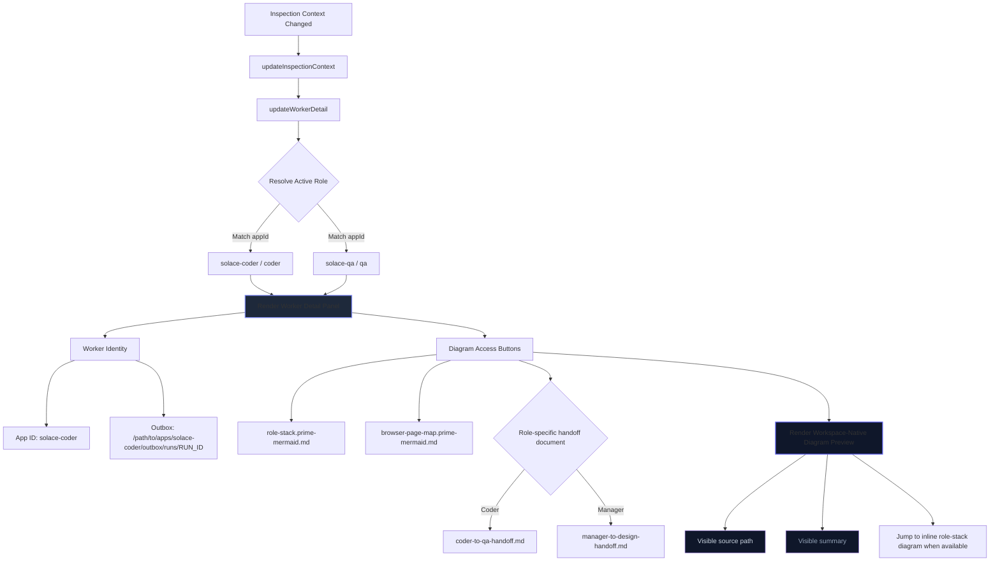

# Worker Detail & Diagram Access Flow

Governs: how the workspace surfaces explicit worker identity and provides native access to governing Prime Mermaid diagrams for the active Dev context.

```mermaid
flowchart TD
    A[Inspection Context Changed] --> B[updateInspectionContext]
    B --> C[updateWorkerDetail]
    
    C --> D{Resolve Active Role}
    D -->|Match appId| E[solace-coder / coder]
    D -->|Match appId| F[solace-qa / qa]
    
    E & F --> G[Render Worker Detail Panel]
    
    G --> H[Worker Identity]
    H --> H1["App ID: solace-coder"]
    H --> H2["Outbox: /path/to/apps/solace-coder/outbox/runs/RUN_ID"]
    
    G --> I[Diagram Access Buttons]
    I --> J["role-stack.prime-mermaid.md"]
    I --> K["browser-page-map.prime-mermaid.md"]
    I --> L{Role-specific handoff document}
    L -->|Coder| M["coder-to-qa-handoff.md"]
    L -->|Manager| N["manager-to-design-handoff.md"]
    
    I --> O[Render Workspace-Native Diagram Preview]
    O --> P[Visible source path]
    O --> Q[Visible summary]
    O --> R[Jump to inline role-stack diagram when available]

    style G fill:#1e293b,stroke:#818cf8,stroke-width:2px
    style O fill:#0f172a,stroke:#6366f1,stroke-width:2px
    style P fill:#0f172a,color:#cbd5e1
    style Q fill:#0f172a,color:#94a3b8
```
