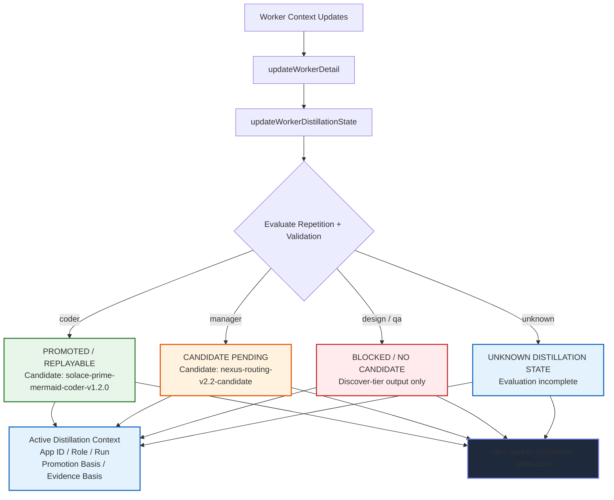

# Convention Distillation & Promotion Flow

Governs: how the workspace maps active workers to convention distillation and promotion state (SI16).

```mermaid
flowchart TD
    A[Worker Context Updates] --> B[updateWorkerDetail]
    B --> C[updateWorkerDistillationState]

    C --> D{Evaluate Repetition + Validation}
    D -->|coder| P1["PROMOTED / REPLAYABLE\nCandidate: solace-prime-mermaid-coder-v1.2.0"]
    D -->|manager| P2["CANDIDATE PENDING\nCandidate: nexus-routing-v2.2-candidate"]
    D -->|design / qa| P3["BLOCKED / NO CANDIDATE\nDiscover-tier output only"]
    D -->|unknown| P4["UNKNOWN DISTILLATION STATE\nEvaluation incomplete"]

    P1 --> CTX["Active Distillation Context\nApp ID / Role / Run\nPromotion Basis / Evidence Basis"]
    P2 --> CTX
    P3 --> CTX
    P4 --> CTX

    P1 --> UI[dev-worker-distillation-state-card]
    P2 --> UI
    P3 --> UI
    P4 --> UI

    classDef pass fill:#e8f5e9,stroke:#2e7d32,stroke-width:2px
    classDef warn fill:#fff3e0,stroke:#e65100,stroke-width:2px
    classDef fail fill:#ffebee,stroke:#c62828,stroke-width:2px
    classDef info fill:#e3f2fd,stroke:#1565c0,stroke-width:2px

    class P1 pass
    class P2 warn
    class P3 fail
    class P4 info
    class CTX info

    style UI fill:#1e293b,stroke:#818cf8,stroke-width:2px
```
