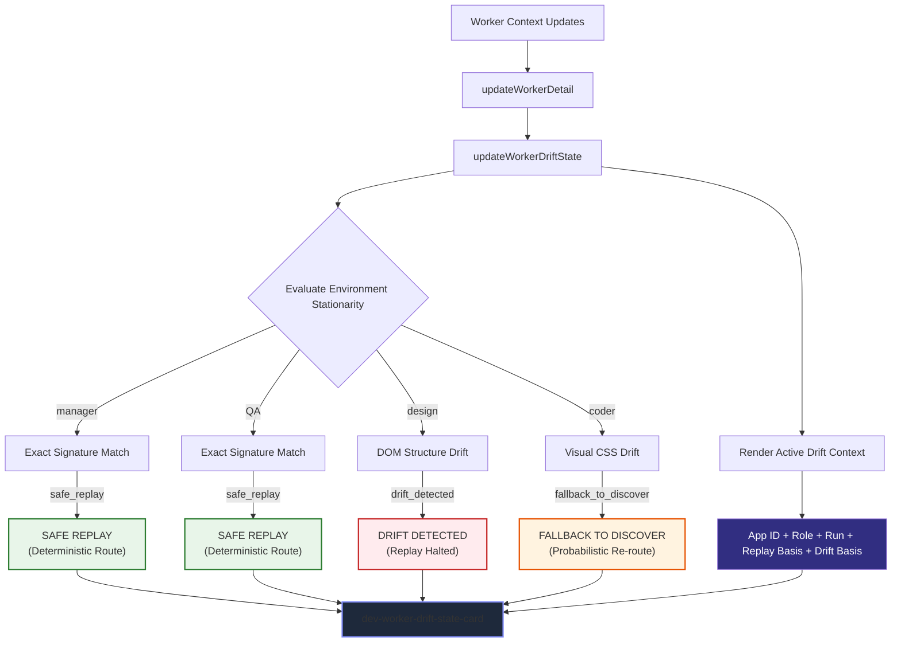

# Drift Detection & Adaptive Replay Flow

Governs: how the workspace maps active workers to drift detection and adaptation layers (SI12).

```mermaid
flowchart TD
    A[Worker Context Updates] --> B[updateWorkerDetail]
    B --> C[updateWorkerDriftState]
    C --> C0[Render Active Drift Context]
    
    C --> D{Evaluate Environment Stationarity}
    D -->|manager| E_M[Exact Signature Match]
    D -->|QA| E_Q[Exact Signature Match]
    D -->|design| E_D[DOM Structure Drift]
    D -->|coder| E_C[Visual CSS Drift]

    E_M -->|safe_replay| SR1["SAFE REPLAY\n(Deterministic Route)"]
    E_Q -->|safe_replay| SR2["SAFE REPLAY\n(Deterministic Route)"]
    E_D -->|drift_detected| DD["DRIFT DETECTED\n(Replay Halted)"]
    E_C -->|fallback_to_discover| FD["FALLBACK TO DISCOVER\n(Probabilistic Re-route)"]

    C0 --> C1["App ID + Role + Run + Replay Basis + Drift Basis"]
    SR1 --> UI[dev-worker-drift-state-card]
    SR2 --> UI
    DD --> UI
    FD --> UI
    C1 --> UI

    classDef pass fill:#e8f5e9,stroke:#2e7d32,stroke-width:2px
    classDef fail fill:#ffebee,stroke:#c62828,stroke-width:2px
    classDef warn fill:#fff3e0,stroke:#e65100,stroke-width:2px
    classDef forbidden fill:#ffefef,stroke:#cc0000,stroke-width:2px
    
    class SR1 pass
    class SR2 pass
    class DD fail
    class FD warn

    style UI fill:#1e293b,stroke:#818cf8,stroke-width:2px
    style C1 fill:#312e81,color:#fff
```
