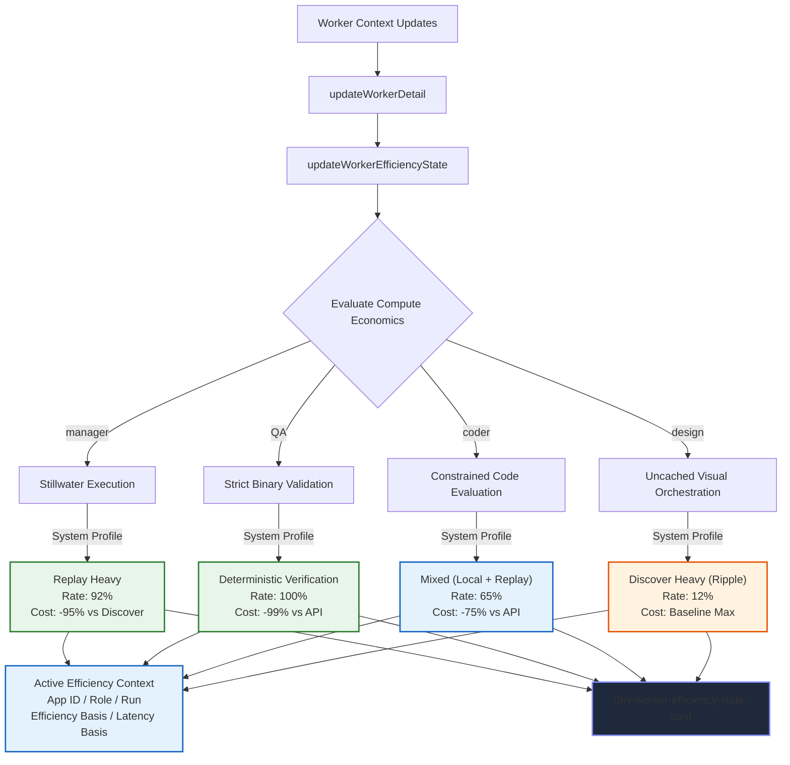

# Efficiency Metrics & Replay Economics

Governs: how the workspace maps active workers to the execution efficiency profiles (SI19).

```mermaid
flowchart TD
    A[Worker Context Updates] --> B[updateWorkerDetail]
    B --> C[updateWorkerEfficiencyState]
    
    C --> D{Evaluate Compute Economics}
    D -->|manager| E_M[Stillwater Execution]
    D -->|QA| E_Q[Strict Binary Validation]
    D -->|coder| E_C[Constrained Code Evaluation]
    D -->|design| E_D[Uncached Visual Orchestration]

    E_M -->|System Profile| P1["Replay Heavy\nRate: 92%\nCost: -95% vs Discover"]
    E_Q -->|System Profile| P2["Deterministic Verification\nRate: 100%\nCost: -99% vs API"]
    E_C -->|System Profile| P3["Mixed (Local + Replay)\nRate: 65%\nCost: -75% vs API"]
    E_D -->|System Profile| P4["Discover Heavy (Ripple)\nRate: 12%\nCost: Baseline Max"]

    P1 --> CTX["Active Efficiency Context\nApp ID / Role / Run\nEfficiency Basis / Latency Basis"]
    P2 --> CTX
    P3 --> CTX
    P4 --> CTX

    P1 --> UI[dev-worker-efficiency-state-card]
    P2 --> UI
    P3 --> UI
    P4 --> UI

    classDef pass fill:#e8f5e9,stroke:#2e7d32,stroke-width:2px
    classDef warn fill:#fff3e0,stroke:#e65100,stroke-width:2px
    classDef fail fill:#ffebee,stroke:#c62828,stroke-width:2px
    classDef info fill:#e3f2fd,stroke:#1565c0,stroke-width:2px
    
    class P1 pass
    class P2 pass
    class P3 info
    class P4 warn
    class CTX info

    style UI fill:#1e293b,stroke:#818cf8,stroke-width:2px
```
