# Execution Mode & Convention Visibility Flow

Governs: how the workspace explicitly renders execution states (Discover vs Replay) and the underlying Prime Conventions that bound the current worker context.

```mermaid
flowchart TD
    A[Worker Context Updates] --> B[updateWorkerDetail]
    B --> C[updateWorkerExecutionMode]
    C --> C0[Render Active Execution Context]
    
    C --> D{Resolve Active Role}
    D -->|manager| E[Manager Mode]
    D -->|design| F[Design Mode]
    D -->|coder| G[Coder Mode]
    D -->|qa| H[QA Mode]
    
    E -->|Mode| E_M[DISCOVER]
    E -->|Convention| E_C["solace-dev-workspace.md (Ruleset)"]

    F -->|Mode| F_M[DISCOVER]
    F -->|Convention| F_C["prime-mermaid-substrate.md (Architecture Modeling)"]

    G -->|Mode| G_M[DISCOVER]
    G -->|Convention| G_C["Coding Standards / UI Mappings"]

    H -->|Mode| H_M[REPLAY]
    H -->|Convention| H_C["solace-worker-inbox-contract.md (Verification Playbook)"]

    E_M & F_M & G_M --> I[Render Discover Shell: Amber]
    H_M --> J[Render Replay Shell: Green]
    
    E_C & F_C & G_C & H_C --> K[Render Convention Text: Indigo]
    
    C0 --> C1["App ID + Role + Run + Mode Basis + Convention Basis"]
    I & J & K & C1 --> L[dev-worker-execution-mode-card]
    
    style L fill:#1e293b,stroke:#818cf8,stroke-width:2px
    style I fill:#f59e0b,color:#fff
    style J fill:#10b981,color:#fff
    style C1 fill:#312e81,color:#fff
```

