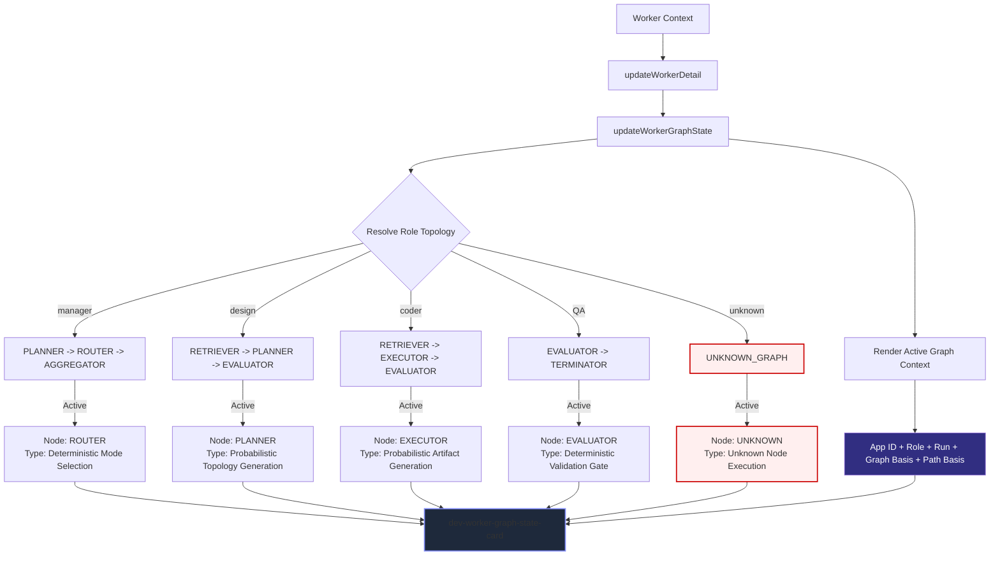

# Execution Graph Space

Governs: how the workspace maps active workers to the execution pipeline formally defined in SI10.

```mermaid
flowchart TD
    A[Worker Context] --> B[updateWorkerDetail]
    B --> C[updateWorkerGraphState]
    C --> C0[Render Active Graph Context]
    
    C --> D{Resolve Role Topology}
    D -->|manager| E_PLAN[PLANNER -> ROUTER -> AGGREGATOR]
    D -->|design| E_DES[RETRIEVER -> PLANNER -> EVALUATOR]
    D -->|coder| E_COD[RETRIEVER -> EXECUTOR -> EVALUATOR]
    D -->|QA| E_QA[EVALUATOR -> TERMINATOR]
    D -->|unknown| F_UNK[UNKNOWN_GRAPH]

    E_PLAN -->|Active| A_PLAN["Node: ROUTER\nType: Deterministic Mode Selection"]
    E_DES -->|Active| A_DES["Node: PLANNER\nType: Probabilistic Topology Generation"]
    E_COD -->|Active| A_COD["Node: EXECUTOR\nType: Probabilistic Artifact Generation"]
    E_QA -->|Active| A_QA["Node: EVALUATOR\nType: Deterministic Validation Gate"]
    F_UNK -->|Active| A_UNK["Node: UNKNOWN\nType: Unknown Node Execution"]

    C0 --> C1["App ID + Role + Run + Graph Basis + Path Basis"]
    A_PLAN --> UI[dev-worker-graph-state-card]
    A_DES --> UI
    A_COD --> UI
    A_QA --> UI
    A_UNK --> UI
    C1 --> UI

    classDef forbidden fill:#ffefef,stroke:#cc0000,stroke-width:2px
    class F_UNK forbidden
    class A_UNK forbidden
    
    style UI fill:#1e293b,stroke:#818cf8,stroke-width:2px
    style C1 fill:#312e81,color:#fff
```
