# Human Approval & Intervention Visibility Flow

Governs: how the workspace explicitly renders human-in-the-loop checkpoints (Paper SI17) to prevent autonomous AI execution limits from being obscured in run logs.

```mermaid
flowchart TD
    A[Worker Context Updates] --> B[updateWorkerDetail]
    B --> C[updateWorkerHumanGate]
    C --> C0[Render Active Human Gate Context]
    
    C --> D{Resolve Active Role State}
    D -->|manager| E[not_yet_at_gate]
    D -->|design| F[awaiting_human]
    D -->|coder| G[intervention_required]
    D -->|qa| H[approved]
    
    E -->|Icon| E_I["⏳ Gray"]
    E -->|Message| E_M["Autonomous parsing active."]

    F -->|Icon| F_I["🛑 Red"]
    F -->|Message| F_M["Blocked pending visual review."]
    F -->|Action| F_A["Render [Review & Approve] btn"]

    G -->|Icon| G_I["⚠️ Amber"]
    G -->|Message| G_M["Lint or constraint failed."]
    G -->|Action| G_A["Render [Review & Approve] btn"]

    H -->|Icon| H_I["✅ Green"]
    H -->|Message| H_M["Human review completed."]

    C0 --> C1["App ID + Role + Run + Gate Basis + Intervention Basis"]
    E_I & E_M & C1 --> I[dev-worker-human-gate-card]
    F_I & F_M & F_A --> I
    G_I & G_M & G_A --> I
    H_I & H_M --> I
    
    style I fill:#1e293b,stroke:#818cf8,stroke-width:2px
    style C1 fill:#312e81,color:#fff
```

