# Worker Inbox / Outbox Visibility Flow

Governs: how the workspace surfaces explicit role inputs and result surfaces to make the current worker contract operationally legible without relying purely on run history inference.

```mermaid
flowchart TD
    A[Worker Context Updates] --> B[updateWorkerDetail]
    B --> C[updateWorkerInboxOutbox]
    
    C --> D{Resolve Active Role}
    D -->|manager| E[Manager Contract]
    D -->|design| F[Design Contract]
    D -->|coder| G[Coder Contract]
    D -->|qa| H[QA Contract]
    
    E -->|Inbox| E_IN["User Request / Assignment Context\nsolace-dev-workspace.md\nsolace-worker-inbox-contract.md"]
    E -->|Outbox| E_OUT["manager-to-design-handoff.md\nProject Map Updates"]

    F -->|Inbox| F_IN["manager-to-design-handoff.md\nProduct Requirements"]
    F -->|Outbox| F_OUT["design-to-coder-handoff.md\nUI Maps / Figma Targets"]

    G -->|Inbox| G_IN["design-to-coder-handoff.md\nTODO.md (Current Round)"]
    G -->|Outbox| G_OUT["coder-to-qa-handoff.md\nCode Commits\nApp Outbox / Runs"]

    H -->|Inbox| H_IN["coder-to-qa-handoff.md\nApp Outbox / Runs\nCode Changes"]
    H -->|Outbox| H_OUT["qa-signoffs\nReview Reports / Bug Triage"]

    E & F & G & H --> I[Render dev-worker-inbox-outbox-card]
    I --> J[Show active app / role / run context]
    I --> K[Show outbox root for the selected run]
    
    style I fill:#1e293b,stroke:#818cf8,stroke-width:2px
```

