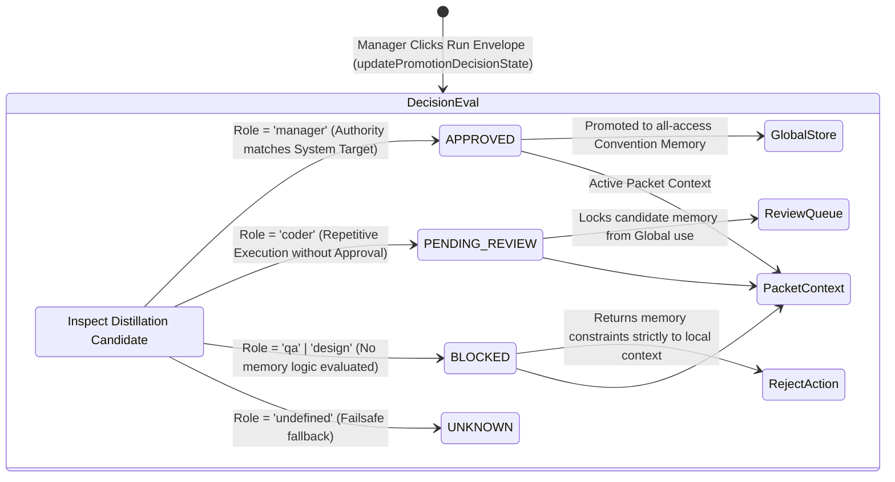

<!-- Diagram: 24-cpu-swarm-node-architecture -->
---
target_schema: prime-mermaid-v1
confidence: verification_gated
author: Grace Hopper (QA Diagrammer constraints)
description: Formal state architecture of the SAM27 Human-in-the-Loop Promotion Decision pipeline. Maps candidate memory generated internally against Manager-driven validation gates.
context_paper: SI17 Human-in-the-Loop, SI18 Transparency as a Product Feature
---

# Structure: Worker Promotion Decision States

The system implements transparent human oversight (SI17/SI18), presenting the exact decision block bridging automated repeating signals into shared intelligent memory. 

## State Dictionary
- `APPROVED`: The highest verification state where the human authority confirms the execution pattern successfully represents a durable memory component perfectly aligned to Solace goals.
- `PENDING_REVIEW`: Intelligent system correctly recognizes repetition, yet legally yields authority blocking full deployment until human sign-off verifies it limits unexpected side-effects.
- `BLOCKED`: Denied promotion path entirely.
- `UNKNOWN`: Fallback. Protects UI and data structure from hallucinatory logic.
