# Transparency & Proof State Flow

Governs: how the workspace explicitly renders execution proof levels (Paper SI18) based on whether mathematical algorithms and visual evidence thresholds are satisfied.

```mermaid
flowchart TD
    A[Worker Context Updates] --> B[updateWorkerDetail]
    B --> C[updateWorkerProofState]
    C --> C0[Render Active Proof Context]
    
    C --> D{Resolve Certification Level}
    D -->|manager| E[PROVEN]
    D -->|QA| E
    D -->|design| F[PARTIAL]
    D -->|coder| G[MISSING]
    
    E -->|Icon| E_I["🛡️ Green"]
    E -->|Evidence| E_E["Full Logs, Signatures, Hashes present"]

    F -->|Icon| F_I["⚖️ Amber"]
    F -->|Evidence| F_E["Handoffs present, Countersignatures missing"]

    G -->|Icon| G_I["❓ Red"]
    G -->|Evidence| G_E["Local traces only. Missing tests and screenshots."]

    C0 --> C1["App ID + Role + Run + Proof Basis + Transparency Basis"]
    E_I & E_E & C1 --> I[dev-worker-proof-state-card]
    F_I & F_E --> I
    G_I & G_E --> I
    
    style I fill:#1e293b,stroke:#818cf8,stroke-width:2px
    style C1 fill:#312e81,color:#fff
```

